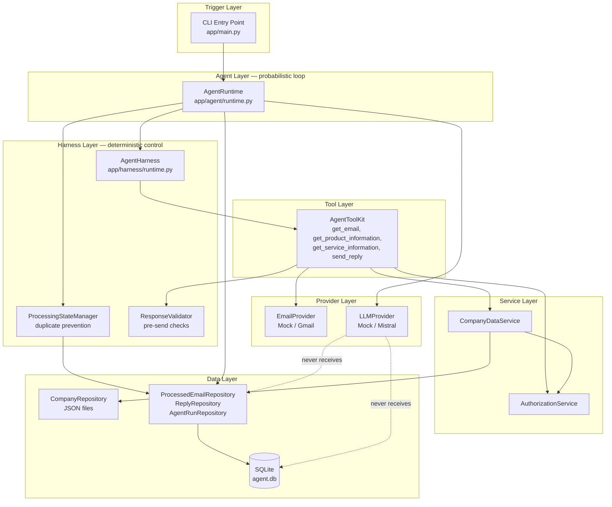
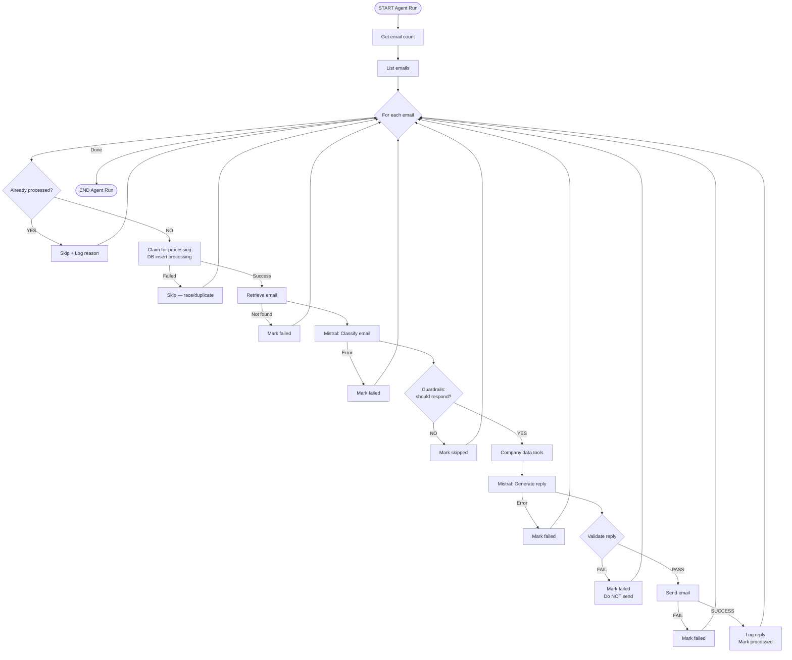
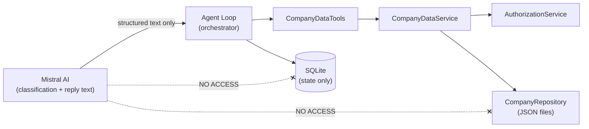
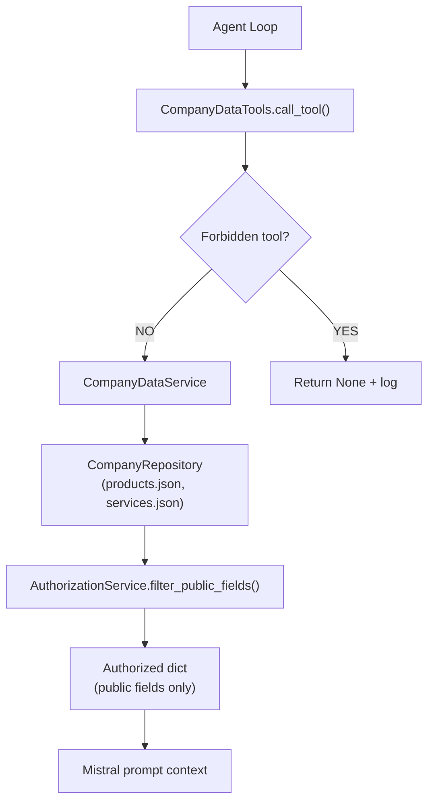
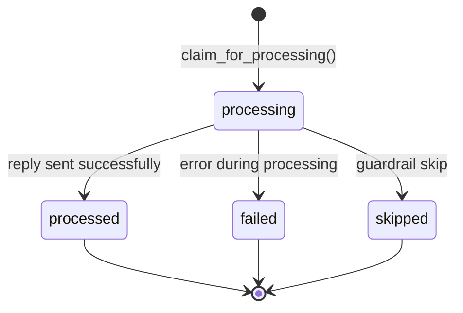
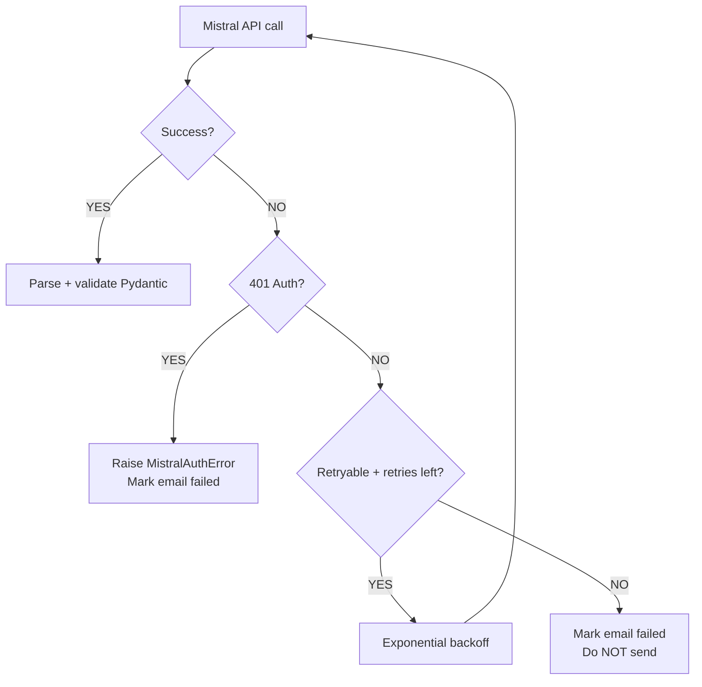
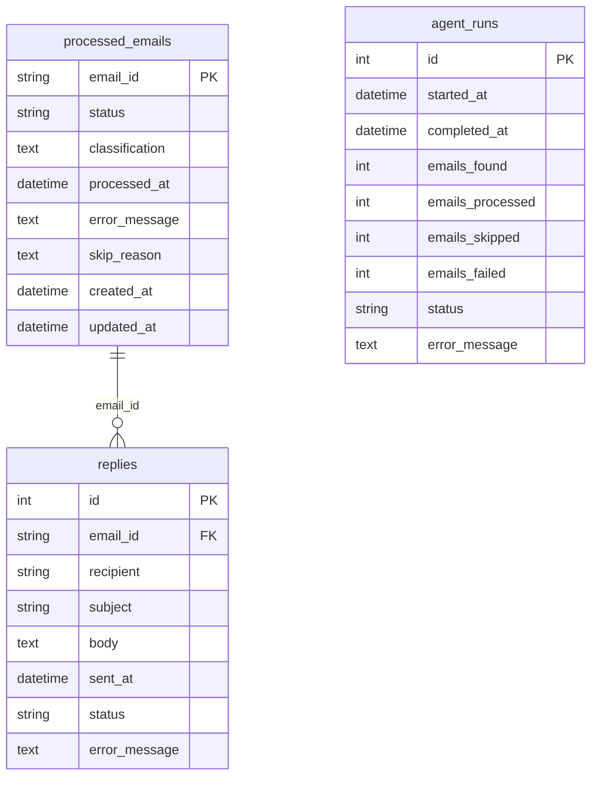
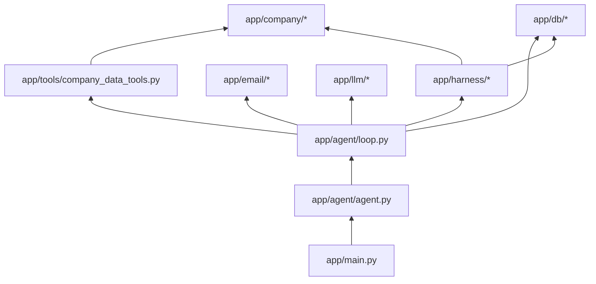
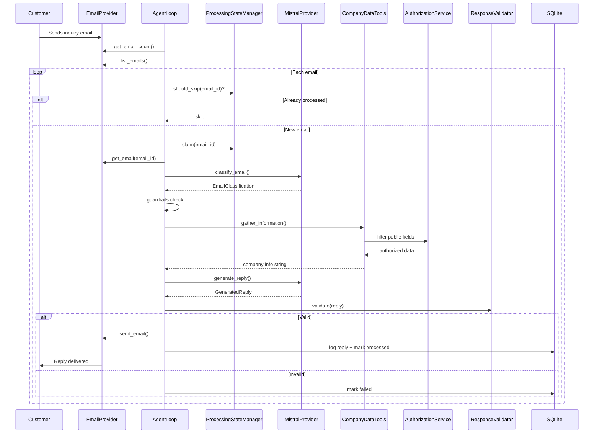

# AI Email Handling Agent

An agentic email automation system using Mistral AI, controlled tools, deterministic guardrails, and evaluation-driven testing.

Built as a technical evaluation prototype for NovaAI (fictional company) — designed for a 30-minute code walkthrough and production-minded architectural review.

---

## Table of Contents

1. [Project Overview](#1-project-overview)
2. [Problem Statement](#2-problem-statement)
3. [Requirements](#3-requirements)
4. [High-Level System Architecture](#4-high-level-system-architecture)
5. [Core Agent Workflow](#5-core-agent-workflow)
6. [Agent Loop](#6-agent-loop)
7. [Agent Tools](#7-agent-tools)
8. [Tool Security Model](#8-tool-security-model)
9. [Company Data Authorization](#9-company-data-authorization)
10. [Deterministic vs Probabilistic Decisions](#10-deterministic-vs-probabilistic-decisions)
11. [Mistral AI Integration](#11-mistral-ai-integration)
12. [Email Classification](#12-email-classification)
13. [Response Generation](#13-response-generation)
14. [Guardrail 1 — Duplicate Email Prevention](#14-guardrail-1--duplicate-email-prevention)
15. [Guardrail 2 — No Direct Database Access](#15-guardrail-2--no-direct-database-access)
16. [Harness](#16-harness)
17. [Error Handling](#17-error-handling)
18. [Logging and Audit](#18-logging-and-audit)
19. [Database / State Model](#19-database--state-model)
20. [Testing Strategy](#20-testing-strategy)
21. [Unit Tests](#21-unit-tests)
22. [LLM Evals](#22-llm-evals)
23. [Risk Register](#23-risk-register)
24. [Repository Structure](#24-repository-structure)
25. [Technology Stack](#25-technology-stack)
26. [Application Layout](#26-application-layout)
27. [Core Product Workflow](#27-core-product-workflow)
28. [Setup and Running](#28-setup-and-running)
29. [Environment Variables](#29-environment-variables)
30. [Demo Scenario](#30-demo-scenario)
31. [Recommended 30-Minute Walkthrough](#31-recommended-30-minute-walkthrough)
32. [Files to Study First](#32-files-to-study-first)
33. [Limitations](#33-limitations)
34. [Future Improvements](#34-future-improvements)
35. [Additional Documentation](#35-additional-documentation)

---

## 1. Project Overview

### What the Email Agent Does

The AI Email Handling Agent periodically (on invocation) checks a mailbox, discovers emails, classifies each message, retrieves **only authorized** company information through controlled application tools, generates grounded replies using **Mistral AI**, validates those replies deterministically, sends responses, and logs all outcomes to a persistent SQLite database.

### Business Problem

NovaAI receives inbound emails covering product pricing, feature questions, service inquiries, spam, job applications, and requests for confidential information. Manual triage does not scale. The agent automates:

- Discovery and counting of mailbox messages
- Semantic understanding of customer intent
- Safe retrieval of public company data
- Professional, grounded reply generation
- Audit logging of every decision and action

### Why an Agent Is Appropriate

Email handling requires **semantic interpretation** (what does the customer mean?) combined with **strict operational guardrails** (never process twice, never leak restricted data). A pure rules engine cannot understand intent; a pure LLM prompt cannot enforce security. This project combines both: Mistral for understanding, Python for enforcement.

### Deterministic vs LLM Decisions

| Layer | Responsibility |
|-------|----------------|
| **Deterministic (Python)** | Duplicate detection, state transitions, authorization, validation, sending, logging |
| **Probabilistic (Mistral AI)** | Email classification, intent understanding, natural-language reply generation |

The system performs actions (send email, update database) only after deterministic checks pass.

> **Architecture (feature branch):** Production uses **`AgentRuntime`** (`app/agent/runtime.py`) — a **genuine agentic loop** where the LLM chooses each next tool or FINAL action via structured `AgentDecision`. **`AgentHarness`** (`app/harness/runtime.py`) provides deterministic controls (authorization, limits, duplicate guard). Legacy predetermined workflow remains in `app/agent/loop.py` (deprecated). See [docs/presentation.md](docs/presentation.md) and [docs/AGENT_WORKFLOW_DIAGRAM.md](docs/AGENT_WORKFLOW_DIAGRAM.md).

---

## 2. Problem Statement

### Original Requirements (AIYAN / Boni Assignment)

The agent must:

1. Run periodically and check a specific mailbox
2. Find the count of emails
3. Retrieve the list of emails
4. Retrieve a specific email
5. Decide which emails require action
6. Determine whether an email is an inquiry for a product or service offered by the company
7. For emails the agent is authorized to reply to:
   - Understand the context
   - Retrieve authorized company information
   - Construct an appropriate reply
   - Ground the reply on authorized company data
   - Send the reply
   - Log the reply

### Mandatory Guardrail #1 — No Duplicate Processing

The same email must **never** be processed more than once. Enforced via:

- Persistent SQLite state (`processed_emails` table)
- `email_id` PRIMARY KEY constraint
- Application-level claim logic with race-condition handling

### Mandatory Guardrail #2 — No Direct Database Access by the LLM

The agent/LLM must **not** directly query the company database. Company information is accessed only through explicitly defined, authorization-filtered tools.

---

## 3. Requirements

| Requirement | Description | Implementation Status |
|-------------|-------------|----------------------|
| Email polling | Check mailbox on agent run | **IMPLEMENTED** — single CLI invocation per run; no cron/scheduler |
| Periodic execution | Run on a schedule | **PARTIALLY IMPLEMENTED** — manual/CLI trigger; external scheduler not included |
| Email count | Return number of emails | **IMPLEMENTED** — `EmailProvider.get_email_count()` |
| Email listing | List email summaries | **IMPLEMENTED** — `EmailProvider.list_emails()` |
| Email retrieval | Fetch full email by ID | **IMPLEMENTED** — `EmailProvider.get_email(email_id)` |
| Email classification | Determine intent and action | **IMPLEMENTED** — Mistral / MockLLM → `EmailClassification` |
| Product/service detection | Identify product/service inquiries | **IMPLEMENTED** — `is_product_or_service_inquiry` field |
| Company data retrieval | Fetch approved company info | **IMPLEMENTED** — `CompanyDataTools` |
| Authorization | Filter restricted fields | **IMPLEMENTED** — `AuthorizationService` |
| Response generation | Generate grounded reply | **IMPLEMENTED** — Mistral / MockLLM → `GeneratedReply` |
| Response validation | Validate before send | **IMPLEMENTED** — `ResponseValidator` |
| Email sending | Send reply to customer | **IMPLEMENTED** — `EmailProvider.send_email()` |
| Logging | Structured application logging | **IMPLEMENTED** — Python `logging` module |
| Reply persistence | Store sent replies | **IMPLEMENTED** — `replies` table |
| Duplicate prevention | Never process same email twice | **IMPLEMENTED** — DB PK + state machine |
| Database access restriction | LLM cannot query DB | **IMPLEMENTED** — no SQL tools exposed |
| Unit tests | Deterministic test suite | **IMPLEMENTED** — 46+ pytest tests |
| LLM evals | Probabilistic behavior evaluation | **IMPLEMENTED** — 20-case eval dataset |
| Gmail integration | Real email provider | **PARTIALLY IMPLEMENTED** — code exists; OAuth not configured in repo |
| HTTP API | REST endpoints | **PLANNED** — FastAPI in `requirements.txt` but no routes implemented |
| LangGraph orchestration | Graph-based agent | **PLANNED** — not in current codebase |

---

## 4. High-Level System Architecture



### Component Descriptions

| Component | File(s) | Role |
|-----------|---------|------|
| **CLI Entry Point** | `app/main.py`, `run_agent.py` | Loads config, wires dependencies, runs one agent cycle |
| **Agent Runtime** | `app/agent/runtime.py` | LLM-driven agentic loop per email |
| **Agent Factory** | `app/agent/agent.py` | Dependency injection / wiring |
| **Harness** | `app/harness/runtime.py`, `state.py`, `validator.py` | Tool auth, limits, duplicate guard, validation |
| **Email Provider** | `app/email/` | Abstract mailbox access (Mock default, Gmail optional) |
| **LLM Provider** | `app/llm/` | Mistral AI (production) or MockLLM (tests/offline) |
| **Company Data Tools** | `app/tools/agent_toolkit.py`, `registry.py` | LLM-invokable authorized tools |
| **Authorization** | `app/company/authorization.py` | Deterministic field filtering |
| **Repositories** | `app/db/repositories.py` | All database access |
| **SQLite** | `data/agent.db` | Persistent processing state and audit trail |

---

## 5. Core Agent Workflow



---

## 6. Agent Runtime (Agentic Loop)

### Overview

The per-email agent is **`AgentRuntime`** in `app/agent/runtime.py`. Each turn:

1. Build `AgentState` and expose a safe LLM context (`to_llm_context()`).
2. **LLM** returns structured **`AgentDecision`**: `CALL_TOOL` or `FINAL`.
3. **`AgentHarness`** validates the decision (tool registered, authorized, within limits).
4. **`AgentToolKit`** executes the tool deterministically.
5. Tool result is appended to state; loop repeats until `FINAL` or a harness stop condition.

Mailbox discovery (count, list) remains deterministic in the runtime outer loop — the LLM chooses tools **within** each email's processing session.

Legacy predetermined workflow: `app/agent/loop.py` (deprecated, tests skipped).

### When the Loop Starts

1. `app/main.py` loads settings from environment (`.env`)
2. `create_agent()` wires dependencies (`app/agent/agent.py`)
3. `AgentRuntime.run()` is called
4. An `agent_runs` record is created with status `running`

### How Emails Are Discovered

```python
count = self._email.get_email_count()
summaries = self._email.list_emails()
```

For each `EmailSummary`, `_process_email(email_id)` runs the **agentic loop**.

### Processing State Check (Guardrail #1)

Before the agentic loop:

1. `ProcessingStateManager.should_skip(email_id)` — checks terminal states
2. `ProcessingStateManager.claim(email_id)` — atomic DB claim → `processing`

### LLM Decisions (Probabilistic)

Each turn, Mistral/Mock returns `AgentDecision` via structured output / function calling:

| Action | Meaning |
|--------|---------|
| `CALL_TOOL` | Invoke `get_email`, `get_product_information`, `get_service_information`, or `send_reply` |
| `FINAL` | Stop with outcome (`replied`, `skipped`, `failed`, etc.) |

The LLM may also use embedded classification/reply generation inside tool results and FINAL payloads depending on provider flow.

### Decision Points

| Step | Decision maker | Type |
|------|---------------|------|
| Skip already processed | `ProcessingStateManager` | Deterministic |
| Claim email | `ProcessedEmailRepository` | Deterministic |
| **Next action** | **LLM `decide_next_action`** | **Probabilistic** |
| Validate tool call | `AgentHarness` | Deterministic |
| Execute tool | `AgentToolKit` | Deterministic |
| Validate reply (send_reply) | `ResponseValidator` | Deterministic |
| Stop (max turns/tools) | `AgentHarness` | Deterministic |

### Loop Termination

- LLM selects `FINAL`, OR
- `MAX_AGENT_TURNS_PER_EMAIL` exceeded (default 15), OR
- `MAX_TOOL_CALLS` exceeded, OR
- Harness guardrail violation / unrecoverable tool error

Outer mailbox loop also stops when all emails processed or `MAX_AGENT_STEPS` exceeded.

### Failure Handling

Failures mark the email as `failed` in `processed_emails` with `error_message`. Send and validation failures do not mark success.

---

### LLM-Callable Tools (AgentToolKit)

The LLM chooses among registered tools in `app/tools/registry.py`. Execution goes through `AgentToolKit` → harness validation.

| Tool | Purpose | Authorization |
|------|---------|---------------|
| `get_email` | Fetch full message for current `email_id` | Agent session only |
| `get_product_information` | Authorized product fields | `AuthorizationService` filters restricted data |
| `get_service_information` | Authorized service fields | Same |
| `send_reply` | Validate + send reply | Requires passing `ResponseValidator` |

Email list/count operations remain in the runtime outer loop (not LLM tools in v1).

### Legacy Email Operations (EmailProvider)

| Operation | Interface Method | Purpose | Inputs | Outputs | Side Effect | Access |
|-----------|-----------------|---------|--------|---------|-------------|--------|
| Get count | `get_email_count()` | Mailbox size | None | `int` | None | Agent loop only |
| List emails | `list_emails()` | Discover messages | None | `list[EmailSummary]` | None | Agent loop only |
| Get email | `get_email(email_id)` | Full message | `email_id` | `EmailMessage \| None` | None | Agent loop only |
| Send email | `send_email(to, subject, body, thread_id)` | Reply to customer | recipient, content | `bool` | Sends email | Agent loop only |

Implementations: `MockEmailProvider` (`app/email/mock_provider.py`), `GmailEmailProvider` (`app/email/gmail_provider.py`).

### Company Data Tools (LLM-adjacent, application-orchestrated)

| Tool | Purpose | Inputs | Outputs | Side Effect | Access |
|------|---------|--------|---------|-------------|--------|
| `get_product_information` | Authorized product data | `product_name: str` | `dict \| None` (public fields only) | Logged in tool call log | Agent loop via `CompanyDataTools` |
| `get_service_information` | Authorized service data | `service_name: str` | `dict \| None` (public fields only) | Logged in tool call log | Agent loop via `CompanyDataTools` |

Defined in: `app/tools/company_data_tools.py`

**Forbidden tools** (blocked in code and policy): `execute_sql`, `query_database`, `list_all_products`, `list_all_services`, `get_internal_data`, `get_customer_data`

### State / Persistence (not LLM tools)

| Component | Purpose |
|-----------|---------|
| `ProcessingStateManager` | Duplicate prevention, state transitions |
| `ProcessedEmailRepository` | CRUD for `processed_emails` |
| `ReplyRepository` | CRUD for `replies` |
| `AgentRunRepository` | CRUD for `agent_runs` |

---

## 8. Tool Security Model

### Architecture



### What Mistral CAN Do

- Receive email text (sender, subject, body)
- Receive **pre-filtered** authorized company information strings
- Return structured classification (`EmailClassification`)
- Return structured reply (`GeneratedReply`)

### What Mistral CANNOT Do

- Receive database credentials or connection objects
- Execute SQL or arbitrary queries
- Call tools directly (no function-calling API exposed to Mistral)
- Access restricted company fields (filtered before data reaches prompts)
- Decide authorization rules (guardrails are deterministic Python code)
- Send emails directly (agent loop sends after validation)

### Enforcement Mechanism

1. **No SQL tools exist** in `ALLOWED_TOOLS`
2. **`AuthorizationService.filter_public_fields()`** strips restricted keys
3. **`ResponseValidator`** scans reply text for restricted patterns
4. **Mistral provider** (`app/llm/mistral_provider.py`) has no database imports

---

## 9. Company Data Authorization



### Information Classification

| Category | Examples | Agent Access |
|----------|----------|--------------|
| **Public / Authorized** | `description`, `features`, `public_pricing`, `supported_integrations`, `use_cases` | Returned to Mistral |
| **Restricted** | `internal_cost`, `customer_list`, `employee_data`, `confidential_roadmap`, `profit_margins` | Never returned |

Policy defined in: `data/company/authorization_policy.json`

Authorization is **deterministic** — enforced in `AuthorizationService`, not by Mistral judgment.

---

## 10. Deterministic vs Probabilistic Decisions

| Decision / Operation | Type | Why |
|---------------------|------|-----|
| Duplicate email detection | **Deterministic** | Correctness and idempotency require exact state |
| Database PRIMARY KEY constraint | **Deterministic** | Race-safe duplicate prevention |
| State transitions (processing → processed/failed/skipped) | **Deterministic** | Audit trail must be exact |
| Tool permission checks | **Deterministic** | Security cannot depend on LLM |
| Authorization field filtering | **Deterministic** | Least privilege enforced in code |
| Response validation (empty, length, restricted content) | **Deterministic** | Pre-send safety gate |
| Email sending | **Deterministic** | Side effect must be code-controlled |
| Logging | **Deterministic** | Auditability |
| Retry limits (`MAX_AGENT_STEPS`, `MAX_TOOL_CALLS`) | **Deterministic** | Prevent runaway loops |
| Mistral API retry logic | **Deterministic** | Infrastructure resilience |
| Email intent classification | **Probabilistic** | Requires semantic understanding |
| Requires-action decision (LLM output) | **Probabilistic** | Interpretation of natural language |
| Product/service inquiry detection | **Probabilistic** | Semantic classification |
| Category assignment | **Probabilistic** | Semantic classification |
| Reply text generation | **Probabilistic** | Natural language generation |

> LLMs are used where semantic interpretation is required. Deterministic code is used where correctness, security, and state consistency are required.

---

## 11. Mistral AI Integration

### Why Mistral

Mistral AI provides cost-effective, capable models with structured JSON output support via `chat.parse()` — suitable for classification and reply generation in a prototype evaluation project.

### Where Mistral Is Called

| Call | Method | Schema |
|------|--------|--------|
| Classification | `MistralProvider.classify_email()` | `EmailClassification` |
| Reply generation | `MistralProvider.generate_reply()` | `GeneratedReply` |

Implementation: `app/llm/mistral_provider.py`

### Inputs Mistral Receives

**Classification:**
- System prompt (`app/agent/prompts.py` — `CLASSIFICATION_SYSTEM_PROMPT`)
- User prompt with sender, subject, body

**Reply generation:**
- System prompt (`REPLY_SYSTEM_PROMPT`) — includes grounding rules
- User prompt with original email + **authorized company info string only**

Mistral never receives raw JSON company files or database records.

### Structured Output Validation

```python
response = client.chat.parse(
    model=self._model,
    messages=messages,
    response_format=response_model,  # Pydantic model
    temperature=0.3,
)
return response_model.model_validate(message.parsed)
```

### Failure Handling

| Error | Handling |
|-------|----------|
| Authentication (401) | `MistralAuthError` — no retry |
| Rate limit (429) | Retry with exponential backoff |
| Timeout | Retry up to `MISTRAL_MAX_RETRIES` |
| Invalid/empty parsed response | `MistralInvalidResponseError` — email marked failed |
| Pydantic validation failure | `MistralInvalidResponseError` — email marked failed |

### API Key Management

```env
MISTRAL_API_KEY=your_key_here
MISTRAL_MODEL=mistral-small-latest
MISTRAL_MAX_RETRIES=3
```

Keys are loaded via `pydantic-settings` from `.env`. Never hardcoded.

### Testing Without Mistral

`MockLLMProvider` (`app/llm/mock_provider.py`) provides keyword-based classification for offline demo and unit tests. Selected when `LLM_PROVIDER=mock`.

Factory: `create_llm_provider()` in `app/llm/provider.py`

---

## 12. Email Classification

### Workflow

1. Agent retrieves email content
2. Calls `llm.classify_email(sender, subject, body)`
3. Receives validated `EmailClassification` Pydantic model
4. Passes classification to deterministic guardrails

### Structured Schema (`app/agent/schemas.py`)

```python
class EmailClassification(BaseModel):
    requires_action: bool
    is_product_or_service_inquiry: bool
    category: str  # product_pricing, product_features, service_inquiry,
                     # demo_request, partnership, job_application, spam,
                     # restricted_info_request, other
    product_names: list[str]
    service_names: list[str]
    reasoning: str
```

There is **no `confidence` field** in the current implementation.

### Why Structured Output

Free-form LLM text requires fragile parsing. Pydantic-validated structured output ensures the agent loop receives typed, predictable data for deterministic guardrail decisions.

---

## 13. Response Generation

### Workflow

1. **Customer email** provided to Mistral (sender, subject, body)
2. **Authorized company information** retrieved via `CompanyDataTools.gather_information_for_classification()` using `product_names` and `service_names` from classification
3. Mistral receives **only** the authorized info string — not the full company database
4. Mistral generates `GeneratedReply` (subject, body, information_used)
5. **`ResponseValidator`** checks: non-empty fields, max length, no restricted content patterns
6. Email sent **only if validation passes**
7. Reply logged to `replies` table
8. Email marked `processed` in `processed_emails`

### Grounding

- Reply prompt explicitly instructs: use ONLY provided company information
- `information_used` field tracks which sources Mistral claims to have used
- Restricted content pattern matching blocks replies containing internal data

### Unsupported Claims

If Mistral invents facts not in authorized data, there is no automated fact-check against source text (eval gap). Validation catches **restricted** content patterns but not all hallucinations.

---

## 14. Guardrail 1 — Duplicate Email Prevention



### Implementation

| Layer | Mechanism |
|-------|-----------|
| **Application** | `ProcessingStateManager.should_skip()` checks terminal states |
| **Application** | `ProcessedEmailRepository.claim_for_processing()` atomic insert |
| **Database** | `processed_emails.email_id` is **PRIMARY KEY** |
| **Race conditions** | `IntegrityError` caught → `race_condition_duplicate` |

### Why DB Constraint Alone Is Insufficient

Application-level checking provides skip reasons and logging. The PRIMARY KEY ensures that even concurrent processes cannot create duplicate records.

### Evidence (QA verified)

**First run:** `mock-001 → processed → reply sent`

**Second run:** `mock-001 → skipped (already_processed) → no reply sent`

Tests: `tests/unit/test_state.py`, `tests/unit/test_agent_loop.py::test_duplicate_email_skipped_on_second_run`

---

## 15. Guardrail 2 — No Direct Database Access

The LLM (Mistral) does not query the database.

```
Mistral → (text only) → Agent Loop → CompanyDataTools → Service → Authorization → Repository → JSON files
Agent Loop → Repositories → SQLite (state/logging only)
```

### Why This Is Safer

- **Least privilege:** Mistral sees only what is necessary for the current reply
- **No SQL injection surface:** No query tools exist
- **Deterministic authorization:** Field filtering happens in Python, not in prompts
- **Auditability:** Tool calls are logged with arguments and status

### Gap Assessment

No gap identified for the assignment requirements. Mistral has no path to database credentials or SQL execution in the current architecture.

---

## 16. Harness

The **harness** is the deterministic control plane around the probabilistic agent. It does **not** choose business actions for the LLM.

| Harness Responsibility | Component | File |
|------------------------|-----------|------|
| Tool validation & limits | **AgentHarness** | `app/harness/runtime.py` |
| State management / idempotency | ProcessingStateManager | `app/harness/state.py` |
| Reply validation (pre-send) | ResponseValidator | `app/harness/validator.py` |
| Legacy step limits | AgentGuardrails | `app/harness/guardrails.py` |
| Stopping conditions | max turns, max tool calls | `app/config.py` |
| Logging / tracing | Python logging, decision trace | `app/agent/runtime.py` |

**Boundary:** LLM proposes `AgentDecision` → harness validates → toolkit executes. Python never hardcodes “always call get_product_information next.”

---

## 17. Error Handling

### Mistral API Failure



### Other Failure Paths

| Failure | Behavior |
|---------|----------|
| Email not found | Mark `failed`, error `email_not_found` |
| Invalid email (empty sender/body) | Mark `failed` |
| Classification exception | Mark `failed`, no reply |
| Guardrail skip | Mark `skipped` with reason |
| Reply generation exception | Mark `failed`, no send |
| Validation failure | Mark `failed`, log reply with `validation_failed` status, **no send** |
| Send failure | Mark `failed`, reply record marked failed, **not** `processed` |
| Max steps exceeded | Abort run, log error |

---

## 18. Logging and Audit

### What Is Logged (via Python `logging`)

| Event | Log level | Example |
|-------|-----------|---------|
| Agent run start/end | INFO | `Agent run 1 started: 10 emails found` |
| Email IDs discovered | INFO | List of IDs |
| Skip decisions | INFO | `Email mock-001 skipped: already_processed` |
| Classification result | INFO | category, requires_action, inquiry flag |
| Tool calls | INFO | `Tool call: get_product_information(...) -> found` |
| Authorization blocks | WARNING | Forbidden tool, restricted content |
| Reply generation | INFO | Subject line (not full body in all cases) |
| Send success/failure | INFO / ERROR | Sent or failed |
| Final processing state | INFO | processed/skipped/failed counts |
| Errors | ERROR / EXCEPTION | Stack traces for run-level failures |

### Why Auditability Matters

An autonomous email agent sends customer-facing messages. Every classification, tool call, authorization decision, and send outcome must be traceable for debugging, compliance, and incident response.

---

## 19. Database / State Model



### State Values

**processed_emails.status:** `pending` → `processing` → `processed` | `failed` | `skipped`

**replies.status:** `pending`, `sent`, `failed`, `validation_failed`

**agent_runs.status:** `running`, `completed`, `failed`

Models: `app/db/models.py`  
Repositories: `app/db/repositories.py`

---

## 20. Testing Strategy

### Unit Tests

For **deterministic** logic: state management, authorization, validation, guardrails, Mistral provider (mocked client). Run with `pytest` — no API keys required.

### Integration Tests

Agent loop tests (`tests/unit/test_agent_loop.py`) exercise multi-component flows with MockEmailProvider and MockLLM against real SQLite (temp file).

QA script: `scripts/qa_verify.py` — comprehensive verification (40 checks).

### Evals

For **probabilistic** Mistral behavior. Separate from unit tests. Dataset: `evals/dataset.json` (20 cases). Runner: `python -m evals.run_evals`.

LLM behavior should not be tested with exact string assertions — use classification accuracy metrics and groundedness checks instead.

---

## 21. Unit Tests

**Total: 36 tests** (verified via `pytest --collect-only`)

| Test File | What It Verifies | Status |
|-----------|------------------|--------|
| `test_state.py` | Claim, skip, duplicate PK, state transitions | PASS |
| `test_authorization.py` | Authorized fields, forbidden tools, restricted filtering | PASS |
| `test_validator.py` | Empty body, restricted content, length limits | PASS |
| `test_agent_loop.py` | Full run, duplicate skip, spam/restricted skip, invalid email | PASS |
| `test_send_failure.py` | Send failure does not mark processed | PASS |
| `test_mistral_provider.py` | Mistral provider with mocked client, retries, auth | PASS |

Run: `pytest` or `pytest -v`

---

## 22. LLM Evals

### Why Evals Are Needed

Mistral classification and reply quality are non-deterministic. Unit tests verify code paths; evals measure semantic accuracy.

### Dataset

`evals/dataset.json` — 20 emails covering product inquiries, service inquiries, spam, job applications, restricted info requests, ambiguous cases.

### Metrics Reported

| Metric | Description |
|--------|-------------|
| Requires action accuracy | Match on `requires_action` |
| Inquiry detection accuracy | Match on `is_product_or_service_inquiry` |
| Category accuracy | Match on `category` |
| Reply groundedness rate | Reply uses authorized data, no restricted content |

### Unit Test vs LLM Eval

| | Unit Test | LLM Eval |
|---|-----------|----------|
| **Target** | Deterministic Python logic | Probabilistic Mistral behavior |
| **Assertion** | Exact state/return values | Accuracy percentages |
| **API key** | Not required (MockLLM) | Uses Mistral when key set |
| **Location** | `tests/unit/` | `evals/` |

Run: `python -m evals.run_evals`

---

## 23. Risk Register

| Risk | Probability | Impact | Mitigation | Status |
|------|-------------|--------|------------|--------|
| Hallucination in replies | Medium | High | Grounding prompts + authorized data only + validation | **PARTIAL** — pattern-based validation only |
| Wrong classification | Medium | Medium | Structured output + deterministic guardrails + evals | **IMPLEMENTED** |
| Incorrect action (reply when shouldn't) | Low | High | `AgentGuardrails.should_respond_to_classification()` | **IMPLEMENTED** |
| Duplicate processing | Low | High | PK constraint + claim logic + state machine | **IMPLEMENTED** |
| Unauthorized data exposure | Low | Critical | AuthorizationService + ResponseValidator | **IMPLEMENTED** |
| Prompt injection via email | Medium | High | No direct tool access from LLM; guardrails | **PARTIAL** — no dedicated injection defense |
| Malicious email content | Medium | Medium | Classification + category guardrails | **PARTIAL** |
| Mistral API failure | Medium | Medium | Retry with backoff; mark failed, no send | **IMPLEMENTED** |
| Rate limiting | Medium | Low | Exponential backoff retry | **IMPLEMENTED** |
| Database failure | Low | High | SQLAlchemy transactions; run-level error handling | **IMPLEMENTED** |
| Email delivery failure | Low | Medium | Mark failed, not processed | **IMPLEMENTED** |
| Poor response quality | Medium | Medium | Evals + grounding prompts | **PARTIAL** |
| Insufficient eval coverage | Medium | Medium | 20-case dataset | **PARTIAL** — expandable |

---

## 24. Repository Structure

```
EMAIL AGENT PROJECT/
├── app/
│   ├── main.py                 # CLI entry point
│   ├── config.py               # Environment settings
│   ├── agent/
│   │   ├── agent.py            # Dependency wiring factory
│   │   ├── loop.py             # ★ Explicit agent loop
│   │   ├── prompts.py          # Mistral prompts
│   │   └── schemas.py          # Pydantic models
│   ├── tools/
│   │   └── company_data_tools.py
│   ├── email/
│   │   ├── base.py             # EmailProvider interface
│   │   ├── mock_provider.py
│   │   └── gmail_provider.py
│   ├── company/
│   │   ├── authorization.py
│   │   ├── repository.py
│   │   └── service.py
│   ├── db/
│   │   ├── database.py
│   │   ├── models.py
│   │   └── repositories.py
│   ├── llm/
│   │   ├── base.py
│   │   ├── mistral_provider.py
│   │   ├── mock_provider.py
│   │   ├── provider.py
│   │   └── exceptions.py
│   └── harness/
│       ├── guardrails.py
│       ├── state.py
│       └── validator.py
├── data/
│   ├── company/                # NovaAI knowledge base (JSON)
│   └── emails/
│       └── mock_emails.json    # 10 demo emails
├── tests/
│   ├── conftest.py
│   └── unit/                   # 36 pytest tests
├── evals/
│   ├── dataset.json            # 20 eval cases
│   ├── evaluator.py
│   └── run_evals.py
├── scripts/
│   └── qa_verify.py            # QA verification script
├── docs/
│   ├── presentation.md
│   └── langgraph_architecture_overview.md
├── .env.example
├── requirements.txt
├── run_agent.py
└── README.md
```

---

## 25. Technology Stack

| Technology | Layer | Purpose | Status |
|------------|-------|---------|--------|
| Python 3.11+ | Runtime | Application language | **Used** (tested on 3.13.2) |
| Mistral AI (`mistralai`) | LLM | Classification + reply generation | **Used** |
| Pydantic | Models | Structured schemas + settings | **Used** |
| pydantic-settings | Config | Environment variable loading | **Used** |
| SQLAlchemy | Persistence | ORM + SQLite access | **Used** |
| SQLite | Database | Processing state + audit | **Used** |
| pytest | Testing | Unit tests | **Used** |
| httpx | HTTP | Mistral SDK dependency | **Used** |
| python-dotenv | Config | `.env` file support | **Used** |
| MockLLM | LLM (dev) | Offline/测试 keyword classifier | **Used** |
| Gmail API | Email | Optional real mailbox | **Partial** — code only |
| FastAPI | API | HTTP endpoints | **Not used** — in requirements only |
| uvicorn | API | ASGI server | **Not used** — in requirements only |
| LangGraph | Orchestration | Graph-based agent | **Not used** |
| Docker | Deployment | Containerization | **Not present** |

---

## 26. Application Layout



| Module | Responsibility |
|--------|---------------|
| `agent/` | Loop orchestration, schemas, prompts, wiring |
| `harness/` | Guardrails, state, validation |
| `tools/` | Controlled company data access |
| `email/` | Mailbox abstraction |
| `llm/` | Mistral + Mock providers |
| `company/` | Knowledge base + authorization |
| `db/` | Models, repositories, session management |
| `tests/` | Deterministic unit tests |
| `evals/` | Probabilistic LLM evaluation |

**Dependency direction:** Outer layers depend on inner abstractions. Mistral depends on nothing in `db/` or `company/repository.py`.

---

## 27. Core Product Workflow



---

## 28. Setup and Running

### Prerequisites

- Python 3.11 or higher
- pip

### Installation

```bash
cd "EMAIL AGENT PROJECT"
python -m venv .venv

# Windows
.venv\Scripts\activate

# macOS/Linux
# source .venv/bin/activate

pip install -r requirements.txt
copy .env.example .env   # Windows
# cp .env.example .env     # macOS/Linux
```

### Configure Environment

Edit `.env`:

```env
EMAIL_PROVIDER=mock
LLM_PROVIDER=mock          # use "mistral" for production
MISTRAL_API_KEY=           # required when LLM_PROVIDER=mistral
MISTRAL_MODEL=mistral-small-latest
```

Database initializes automatically on first run (`data/agent.db`).

### Run the Agent

```bash
python -m app.main
# or
python run_agent.py
```

### Run Unit Tests

```bash
pytest
pytest -v
```

### Run Evals

```bash
python -m evals.run_evals
```

### Run QA Verification

```bash
python scripts/qa_verify.py
```

---

## 29. Environment Variables

| Variable | Required | Default | Purpose |
|----------|----------|---------|---------|
| `EMAIL_PROVIDER` | No | `mock` | `mock` or `gmail` |
| `LLM_PROVIDER` | No | `mock` | `mock` or `mistral` |
| `MISTRAL_API_KEY` | When `LLM_PROVIDER=mistral` | (empty) | Mistral API authentication |
| `MISTRAL_MODEL` | When `LLM_PROVIDER=mistral` | `mistral-small-latest` | Model for classification and replies |
| `MISTRAL_MAX_RETRIES` | No | `3` | API retry count |
| `DATABASE_URL` | No | `sqlite:///data/agent.db` | SQLite connection string |
| `GMAIL_CREDENTIALS_PATH` | When `EMAIL_PROVIDER=gmail` | `credentials.json` | Gmail OAuth credentials |
| `GMAIL_TOKEN_PATH` | When `EMAIL_PROVIDER=gmail` | `token.json` | Gmail OAuth token |
| `MAX_AGENT_STEPS` | No | `50` | Max emails processed per run |
| `MAX_TOOL_CALLS` | No | `10` | Max company tool calls per run |
| `LOG_LEVEL` | No | `INFO` | Logging verbosity |

---

## 30. Demo Scenario

### Sample Email (mock-002 in dataset)

**Subject:** NovaAnalytics features question

**Body:** Hello, we're evaluating analytics platforms. Does NovaAnalytics support real-time dashboards and integration with Snowflake?

### Walkthrough

| Step | What Happens |
|------|--------------|
| 1. Email discovered | `list_emails()` returns `mock-002` among 10 emails |
| 2. State checked | Not in `processed_emails` → proceed |
| 3. Claimed | Inserted with status `processing` |
| 4. Classified | Mistral/MockLLM → `product_features`, inquiry=true |
| 5. Guardrails | `should_respond` → true |
| 6. Tool called | `get_product_information("NovaAnalytics")` |
| 7. Authorized data | Features, integrations returned; `internal_cost` stripped |
| 8. Reply generated | Mistral produces grounded reply |
| 9. Validated | Non-empty, no restricted patterns |
| 10. Sent | `send_email()` to bob@enterprise.com |
| 11. Logged | `replies` record + `processed_emails.status=processed` |

### Second Run — Guardrail Demo

```bash
python -m app.main   # run again
```

**Expected for mock-002:** `Status: skipped`, `Skip reason: already_processed`, `Reply: NOT SENT`

This demonstrates **both guardrails**: no duplicate processing, authorized data only on first run.

---

## 31. Recommended 30-Minute Walkthrough

| Time | Topic | Files to Open |
|------|-------|---------------|
| 0–2 min | Architecture overview | `README.md` §4, this doc |
| 2–7 min | Agent loop | `app/agent/loop.py` |
| 7–12 min | Tools + authorization | `app/tools/company_data_tools.py`, `app/company/authorization.py` |
| 12–15 min | Mistral integration | `app/llm/mistral_provider.py`, `app/agent/schemas.py` |
| 15–20 min | Guardrails | `app/harness/state.py`, `app/harness/guardrails.py`, `app/db/repositories.py` |
| 20–23 min | Deterministic vs probabilistic | `app/agent/loop.py` comments, `README.md` §10 |
| 23–28 min | Tests + evals | `tests/unit/`, `evals/evaluator.py` |
| 28–30 min | Live demo | `python -m app.main` (twice) |

---

## 32. Files to Study First

| Priority | File | Why |
|----------|------|-----|
| 1 | `app/agent/loop.py` | Complete workflow in one file |
| 2 | `app/harness/state.py` | Duplicate prevention |
| 3 | `app/harness/guardrails.py` | Deterministic decision gates |
| 4 | `app/tools/company_data_tools.py` | Controlled tool access |
| 5 | `app/company/authorization.py` | Field-level security |
| 6 | `app/llm/mistral_provider.py` | Mistral structured outputs |
| 7 | `app/db/repositories.py` | State machine + DB constraints |
| 8 | `app/db/models.py` | Schema |
| 9 | `tests/unit/test_state.py` | Guardrail #1 tests |
| 10 | `evals/dataset.json` | Eval coverage |

---

## 33. Limitations

### Prototype Limitations

- **No scheduler:** Agent runs once per CLI invocation; no built-in cron
- **No LangGraph:** Explicit loop only — see future doc for graph migration path
- **No HTTP API:** FastAPI listed in requirements but not implemented
- **Single-threaded:** Sequential email processing
- **SQLite:** Not suitable for high-concurrency production

### LLM Limitations

- MockLLM uses keywords — not semantic (use `LLM_PROVIDER=mistral` for real behavior)
- Eval classification accuracy ~80–85% on edge cases with live Mistral
- No automated hallucination detection beyond restricted-content patterns

### Email Provider Limitations

- Gmail implemented but not tested without OAuth credentials
- Mock provider does not simulate IMAP/API failures beyond send override in tests

### Security Limitations

- Pattern-based restricted content detection (not exhaustive)
- No dedicated prompt-injection defense layer
- No human-in-the-loop approval before send

---

## 34. Future Improvements

### Short Term

- Remove unused FastAPI/uvicorn from requirements or implement health/status endpoints
- Add cron/systemd example for periodic runs
- Expand eval dataset for restricted-info edge cases
- Gmail OAuth setup guide with tested flow

### Medium Term

- Human approval workflow for outbound replies
- Stronger prompt-injection defenses
- LLM-as-judge for reply groundedness scoring
- PostgreSQL for production persistence
- Migrate orchestration to LangGraph (see `docs/langgraph_architecture_overview.md`)

### Long Term

- Multi-mailbox support
- Observability dashboard (OpenTelemetry)
- Supervisor multi-agent architecture for specialized routing
- Production deployment (Docker, CI/CD)

---

## 35. Additional Documentation

| Document | Purpose |
|----------|---------|
| [docs/presentation.md](docs/presentation.md) | 5-slide walkthrough for Boni |
| [docs/langgraph_architecture_overview.md](docs/langgraph_architecture_overview.md) | LangGraph concepts, current vs future architecture |

---

## Quick Reference Commands

```bash
pip install -r requirements.txt
python -m app.main              # Run agent
pytest                          # Unit tests (36 tests)
python -m evals.run_evals       # LLM evals
python scripts/qa_verify.py     # Full QA verification
```
