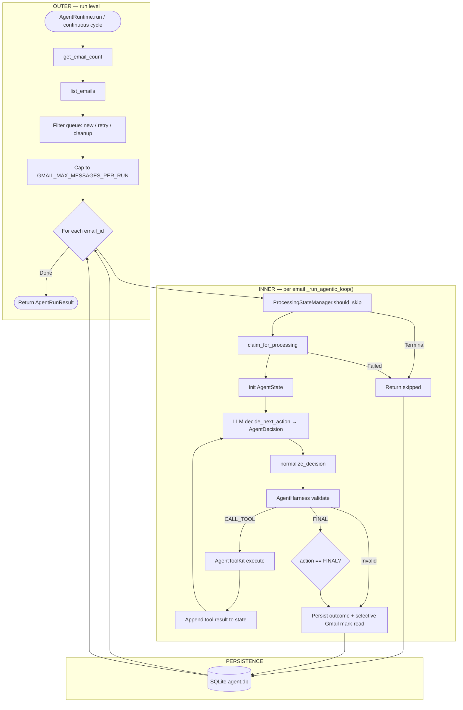
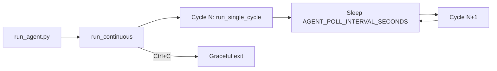

# Email Agent Workflow — Agentic Architecture

**Branches:** `feature/true-agentic-loop`, `feature/continuous-agent-loop`

Production orchestration is **`AgentRuntime`** (`app/agent/runtime.py`) with LLM-chosen tools per turn. Legacy predetermined flow remains in `app/agent/loop.py` (deprecated).

---

## Master Flowchart



---

## Continuous polling (optional)



| Entry | Mode |
|-------|------|
| `python run_agent.py` | Always continuous until Ctrl+C |
| `python -m app.main` | Single cycle unless `AGENT_CONTINUOUS_MODE=true` |

---

## Gmail queue filtering (production)

Before the agentic loop, runtime classifies each unread ID:

| DB record | Action |
|-----------|--------|
| Not in DB | Process (new email) |
| `failed` (retryable, attempts < 2) | Reclaim → retry |
| `skipped` (`completed_without_reply`) | Clear → retry agent |
| `processed` (reply sent) | Batch mark read (cleanup) |
| `skipped` (`human_review:*`) | **Leave UNREAD** — no retry |
| `skipped` (`auto_handled:spam`) | Mark read |
| `skipped` (`completed_without_reply`) | Retry agent |
| `failed` (max attempts) | **Leave UNREAD** — no retry |

Policy module: `app/harness/read_policy.py`

---

## Component Map

| Node | File | Role |
|------|------|------|
| Agent runtime | `app/agent/runtime.py` | Outer mailbox loop + inner agentic loop |
| Decision repair | `app/agent/decision_normalize.py` | Fix malformed Mistral decisions |
| Agent state | `app/agent/state.py` | `AgentState`, LLM-safe context |
| Decision schema | `app/agent/schemas.py` | `AgentDecision`, `AgentFinalOutput` |
| Harness | `app/harness/runtime.py` | Tool auth, limits, validation |
| Tool registry | `app/tools/registry.py` | Registered tool metadata |
| Tool execution | `app/tools/agent_toolkit.py` | Deterministic tool implementations |
| LLM providers | `app/llm/` | `decide_next_action()`, `generate_reply()` |
| Duplicate guard | `app/harness/state.py` | `ProcessingStateManager` |
| Mark-read policy | `app/harness/read_policy.py` | Reply/spam only — human-review stays UNREAD |
| Retry policy | `app/db/repositories.py` | `reclaim_failed_for_retry`, attempt counting |
| Gmail provider | `app/email/gmail_provider.py` | OAuth, scan, selective mark-read, body parsing |
| Reply validation | `app/harness/validator.py` | Pre-send checks |

---

## Registered tools (LLM chooses per turn)

| Tool | Purpose |
|------|---------|
| `get_email` | Fetch full message for current `email_id` |
| `get_product_information` | Authorized NovaAI product data |
| `get_service_information` | Authorized NovaAI service data |
| `send_reply` | Validate + send reply via EmailProvider |

---

## Agentic loop test

> Can the LLM decide what tool/action happens next based on current state and prior tool results?

**Yes** — each turn calls `llm.decide_next_action(state, tool_catalog)`; Python does not hardcode tool order after claim.

Typical pricing inquiry path:

```
get_email → get_product_information → send_reply → FINAL
```

---

## Known limitations (v1)

- Mailbox-level operations (`list_emails`, `get_email_count`) are deterministic, not LLM tools
- `normalize_decision` repairs some Mistral malformed outputs (missing tool name, premature FINAL)
- Gmail `list_emails()` returns IDs only; full body fetched on `get_email` tool call
- Human-review skips stay **unread** in Gmail by design — staff must triage job apps, partnerships, unrelated mail manually

## Selective mark-read (summary)

| Skip / status | Gmail |
|---------------|-------|
| Reply sent | Mark read |
| `auto_handled:spam` | Mark read |
| `human_review:*` | **Stay unread** |
| `failed` | **Stay unread** |

---

## Related docs

| Document | Purpose |
|----------|---------|
| [REAL_API_SYSTEM_FLOW.md](REAL_API_SYSTEM_FLOW.md) | Gmail + Mistral production flow |
| [presentation.md](presentation.md) | 5-slide defense |
| [README.md](../README.md) | Full project reference |
