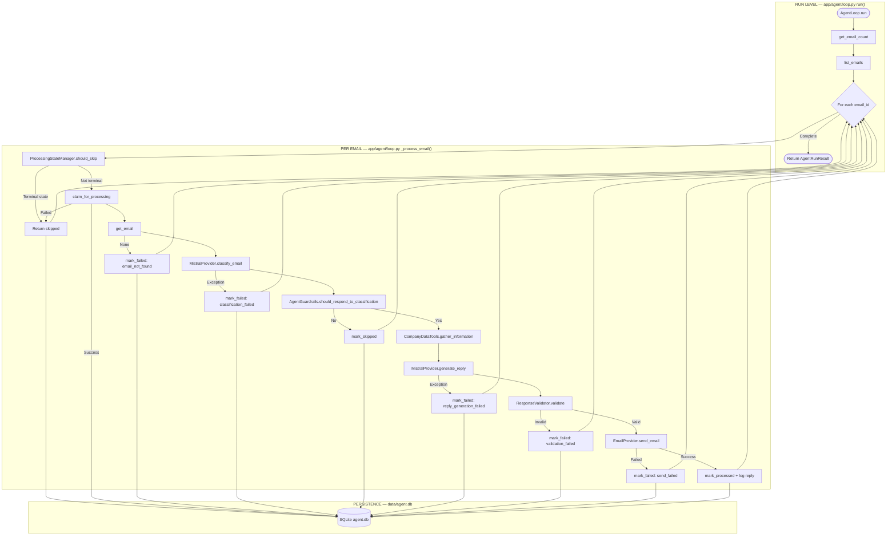
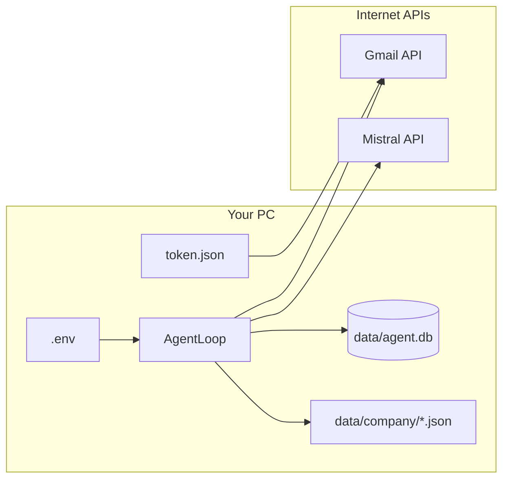

# Email Agent Workflow — Complete Structure Diagram

**CURRENT — Actual Implementation** (not LangGraph)

This document matches the flowchart structure used in [`langgraph_architecture_overview.md`](langgraph_architecture_overview.md) and maps **every node** to source files and storage.

---

## Master Flowchart



---

## Simplified Vertical View (Same Logic)

```
AgentLoop.run                          [loop.py:74]
    │
    ├─► get_email_count                [gmail_provider.py:65]  ──► Gmail API
    │
    ├─► list_emails                    [gmail_provider.py:70]  ──► Gmail API (IDs + metadata)
    │
    └─► FOR EACH email_id ─────────────────────────────────────────────┐
            │                                                             │
            ├─► should_skip? ──YES──► skipped ──► agent.db               │
            │         │ NO                                                │
            ├─► claim_for_processing ──FAIL──► skipped ──► agent.db      │
            │         │ OK                                                │
            ├─► get_email ──MISS──► failed ──► agent.db                  │
            │         │ OK (body in RAM)                                  │
            ├─► classify_email ──ERR──► failed ──► agent.db              │
            │         │ OK                     ──► Mistral API            │
            ├─► should_respond? ──NO──► skipped ──► agent.db             │
            │         │ YES                                               │
            ├─► gather_information           ──► data/company/*.json     │
            ├─► generate_reply ──ERR──► failed ──► agent.db            │
            │         │ OK                     ──► Mistral API            │
            ├─► validate ──FAIL──► failed ──► agent.db                   │
            │         │ OK                                                │
            ├─► send_email ──FAIL──► failed ──► agent.db                 │
            │         │ OK                     ──► Gmail API              │
            └─► mark_processed + log reply ──► agent.db                  │
            │                                                             │
            └─────────────────────────────────────────────────────────────┘
    │
    └─► Return AgentRunResult + commit agent.db  [main.py:70]
```

---

## Node Reference Table

| # | Node (diagram) | File | Function / Method | Lines | Type | Writes to DB? |
|---|----------------|------|-------------------|-------|------|---------------|
| — | **AgentLoop.run** | `app/agent/loop.py` | `run()` | 74–133 | Deterministic | `agent_runs` |
| 1 | **get_email_count** | `app/email/gmail_provider.py` | `get_email_count()` | 65–68 | Deterministic | No |
| 2 | **list_emails** | `app/email/gmail_provider.py` | `list_emails()` | 70–93 | Deterministic | No |
| 3 | **For each email_id** | `app/agent/loop.py` | `for summary in summaries` | 91–96 | Deterministic | No |
| 4 | **should_skip** | `app/harness/state.py` | `should_skip()` | 16–34 | Deterministic | Read only |
| 5 | **Return skipped** | `app/agent/loop.py` | `_process_email()` | 141–145 | Deterministic | No |
| 6 | **claim_for_processing** | `app/db/repositories.py` | `claim_for_processing()` | 45–72 | Deterministic | `processed_emails` |
| 7 | **get_email** | `app/email/gmail_provider.py` | `get_email()` | 95–121 | Deterministic | No (RAM only) |
| 8 | **mark_failed: email_not_found** | `app/agent/loop.py` | `_process_email()` | 157–161 | Deterministic | Yes |
| 9 | **classify_email** | `app/llm/mistral_provider.py` | `classify_email()` | 177–185 | **Probabilistic** | No |
| 10 | **mark_failed: classification_failed** | `app/agent/loop.py` | `_process_email()` | 182–186 | Deterministic | Yes |
| 11 | **should_respond_to_classification** | `app/harness/guardrails.py` | `should_respond_to_classification()` | 51–64 | Deterministic | No |
| 12 | **mark_skipped** | `app/agent/loop.py` | `_process_email()` | 193–197 | Deterministic | Yes |
| 13 | **gather_information** | `app/tools/company_data_tools.py` | `gather_information_for_classification()` | 58–77 | Deterministic | No |
| 14 | **generate_reply** | `app/llm/mistral_provider.py` | `generate_reply()` | 187–202 | **Probabilistic** | No |
| 15 | **mark_failed: reply_generation_failed** | `app/agent/loop.py` | `_process_email()` | 222–226 | Deterministic | Yes |
| 16 | **validate** | `app/harness/validator.py` | `validate()` | 16–42 | Deterministic | No |
| 17 | **mark_failed: validation_failed** | `app/agent/loop.py` | `_process_email()` | 232–244 | Deterministic | Yes + `replies` |
| 18 | **send_email** | `app/email/gmail_provider.py` | `send_email()` | 123–143 | Deterministic | No |
| 19 | **mark_failed: send_failed** | `app/agent/loop.py` | `_process_email()` | 262–268 | Deterministic | Yes |
| 20 | **mark_processed + log reply** | `app/agent/loop.py` | `_process_email()` | 247–277 | Deterministic | `replies` + `processed_emails` |
| — | **Return AgentRunResult** | `app/agent/loop.py` | `return result` | 133 | Deterministic | No |
| — | **commit** | `app/main.py` | `session.commit()` | 70 | Deterministic | Flushes all DB writes |

---

## External Systems (Outside the Diagram)



---

## What Each Storage Node Means

| DB write moment | Table | What is saved |
|-----------------|-------|---------------|
| claim success | `processed_emails` | `email_id`, `status=processing` |
| mark_skipped | `processed_emails` | `status=skipped`, `skip_reason` |
| mark_failed | `processed_emails` | `status=failed`, `error_message` |
| validation_failed | `replies` | reply body with `status=validation_failed` |
| before send | `replies` | reply with `status=pending` |
| send success | `replies` | `status=sent`, `sent_at` |
| mark_processed | `processed_emails` | `status=processed`, `classification` JSON |
| run start/end | `agent_runs` | counters + run status |

**SQLite file path:** `c:\Users\nisar\Desktop\EMAIL AGENT PROJECT\data\agent.db`

**Schema defined in:** `app/db/models.py`  
**Read/write logic:** `app/db/repositories.py`

---

## Legend

| Symbol | Meaning |
|--------|---------|
| Rectangle | Processing step |
| Diamond `{For each email_id}` | Loop |
| **Probabilistic** | Mistral LLM — output may vary |
| **Deterministic** | Python code — same input → same decision |
| `agent.db` | All skip/fail/process/reply audit records |

---

## Related Docs

- End-to-end + Gmail ID explanation: [`REAL_API_SYSTEM_FLOW.md`](REAL_API_SYSTEM_FLOW.md)
- LangGraph concept mapping: [`langgraph_architecture_overview.md`](langgraph_architecture_overview.md)
- Code learning guide: [`EMAIL_AGENT_CODE_LEARNING_GUIDE.md`](EMAIL_AGENT_CODE_LEARNING_GUIDE.md)

---

*Source of truth: `app/agent/loop.py` — `run()` and `_process_email()`*
