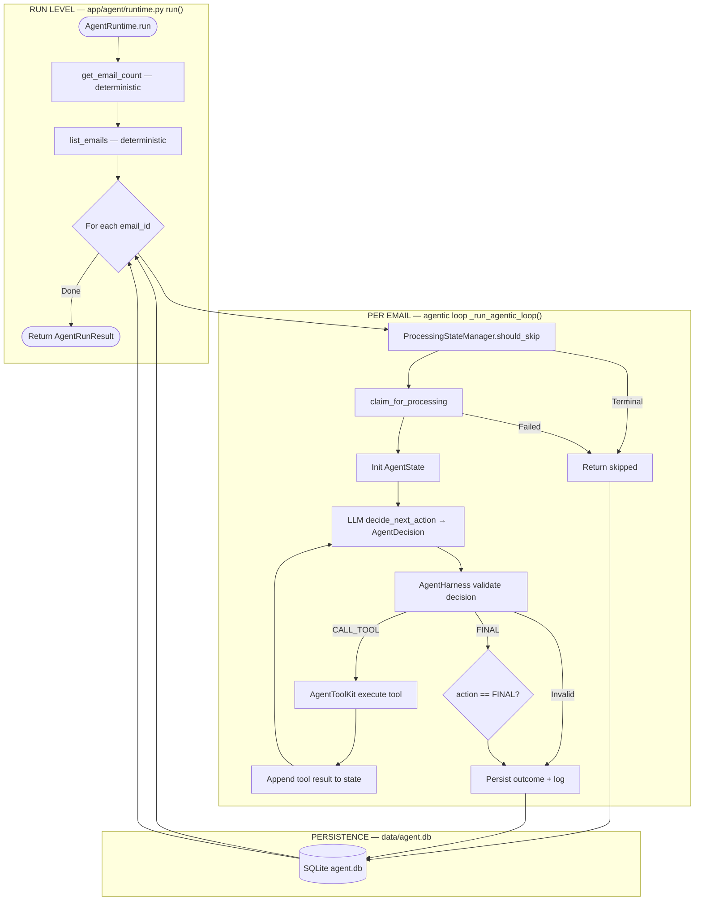

# Email Agent Workflow — Agentic Architecture

**Branch:** `feature/true-agentic-loop` — **AgentRuntime** with LLM-chosen tools.

Legacy predetermined flow (`AgentLoop`) is deprecated; see git history on `main` for the old diagram.

---

## Master Flowchart

---

## Component Map

| Node | File | Role |
|------|------|------|
| Agent runtime | `app/agent/runtime.py` | Outer mailbox loop + inner agentic loop |
| Agent state | `app/agent/state.py` | `AgentState`, LLM-safe context |
| Decision schema | `app/agent/schemas.py` | `AgentDecision`, `AgentFinalOutput` |
| Harness | `app/harness/runtime.py` | Tool auth, limits, validation |
| Tool registry | `app/tools/registry.py` | Registered tool metadata |
| Tool execution | `app/tools/agent_toolkit.py` | Deterministic tool implementations |
| LLM providers | `app/llm/` | `decide_next_action()` structured output |
| Duplicate guard | `app/harness/state.py` | `ProcessingStateManager` |
| Reply validation | `app/harness/validator.py` | Pre-send checks |

---

## Agentic Loop Test

> Can the LLM decide what tool/action happens next based on current state and prior tool results?

**Yes** — each turn calls `llm.decide_next_action(state, tool_catalog)`; Python does not hardcode tool order after claim.

---

## Known Limitation (v1)

Mailbox-level operations (`list_emails`, `get_email_count`) are not LLM tools yet; only per-email tool selection is agentic.
