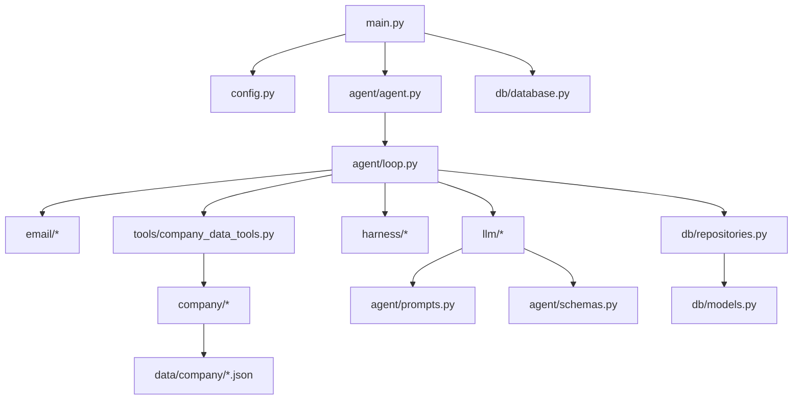
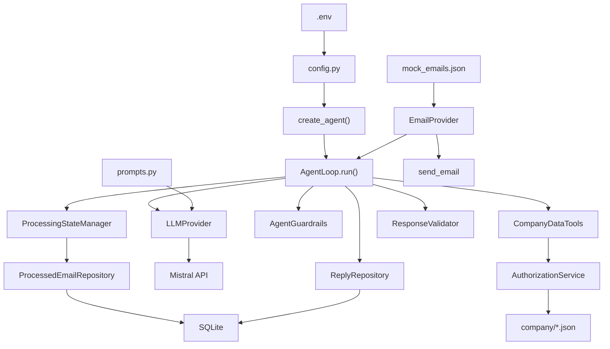

# AI Email Handling Agent — Code Learning Guide

**NovaAI Email Agent Project**  
**Purpose:** Personal textbook for understanding every important file, execution path, and design decision  
**Repository:** `c:\Users\nisar\Desktop\EMAIL AGENT PROJECT`  
**Verified against source:** August 13, 2026  
**Total Python modules inspected:** 41 (28 app + 8 tests + 3 evals + 2 scripts)

---

## How to Use This Document

Do **not** read page 1 to the end like a novel. Use this order:

```
PROJECT → Architecture (Part 1) → Entry Point (Part 4) → Agent Loop (Part 12)
→ Agent State (Part 13) → LangGraph Concepts (Part 11) → Tools (Part 14)
→ Mistral (Part 10) → Company Data → Guardrails (Parts 16–17)
→ Tests/Evals (Parts 21–22) → Execution Trace (Part 5)
```

**Critical honesty:** This project does **NOT** use LangGraph. Orchestration is an explicit `AgentLoop` class. Part 11 maps LangGraph concepts to this codebase for interview preparation.

---

## Table of Contents

| Part | Title | Page Section |
|------|-------|--------------|
| 1 | Project in One Page | §1 |
| 2 | Complete Repository Map | §2 |
| 3 | Recommended Learning Order | §3 |
| 4 | Entry Point | §4 |
| 5 | Complete Execution Trace (mock-002) | §5 |
| 6 | File-to-File Connection Map | §6 |
| 7 | File-by-File Code Learning | §7 |
| 8 | Line Number References | §8 |
| 9 | Configuration | §9 |
| 10 | Mistral AI Integration | §10 |
| 11 | LangGraph (Not Used — Concept Map) | §11 |
| 12 | AgentLoop Execution Diagram | §12 |
| 13 | Agent State | §13 |
| 14 | Tools | §14 |
| 15 | Database | §15 |
| 16 | Database Access Guardrail | §16 |
| 17 | Duplicate Email Guardrail | §17 |
| 18 | Deterministic vs Probabilistic | §18 |
| 19 | Harness | §19 |
| 20 | Error Handling | §20 |
| 21 | Tests | §21 |
| 22 | Evals | §22 |
| 23 | Complete Data Flow | §23 |
| 24 | Complete Call Graph | §24 |
| 25 | If I Change This Line, What Breaks? | §25 |
| 26 | Debugging Guide | §26 |
| 27 | How to Run the Project | §27 |
| 28 | Hands-On Learning Plan | §28 |
| 29 | Self-Test Questions (50+) | §29 |
| 30 | Boni Code Walkthrough Preparation | §30 |
| 31 | Explain the Project Yourself | §31 |
| 32 | Final Cheat Sheet | §32 |

---

# Part 1 — Project in One Page

## What Is This Project?

A **CLI email-handling agent** for fictional company **NovaAI**. On each run it:

1. Reads emails from a mailbox (mock JSON or Gmail)
2. Classifies each email with an LLM (Mock or Mistral)
3. Applies **deterministic guardrails** in Python
4. Retrieves **authorized** company data via two controlled tools
5. Generates a grounded reply with the LLM
6. Validates, sends, logs, and marks emails processed in SQLite

## What Problem Does It Solve?

Customer support teams receive product/service inquiries. This agent automates first-line responses using AI while enforcing:

- No duplicate replies to the same email
- No LLM direct database access
- No leaking restricted company information

## What Happens When the System Starts?

```
python -m app.main
  → load .env settings
  → open SQLite database
  → wire all dependencies (create_agent)
  → AgentLoop.run() processes all emails once
  → commit DB, print results, exit
```

There is **no scheduler**, **no web server**, **no Docker**.

## What Happens When a New Email Arrives?

There is no push/webhook. The agent **polls once per run**:

1. `get_email_count()` → `list_emails()` → iterate each `email_id`
2. Skip if already in terminal DB state
3. Claim → classify → guard → tools → reply → validate → send → mark processed

## What Does the LLM Do? (Probabilistic)

- **Classification:** semantic understanding (category, products, services)
- **Reply generation:** natural language response from authorized data

## What Does Deterministic Code Do?

- Duplicate detection and DB state machine
- Authorization and field filtering
- Tool allowlist enforcement
- Reply validation before send
- Email send and audit logging

## Where Is LangGraph Used?

**Nowhere.** See Part 11. Orchestration is `AgentLoop` in `app/agent/loop.py`.

## Actual Architecture Diagram

```
CLI Entry (main.py / run_agent.py)
       ↓
Configuration (.env → config.py)
       ↓
Dependency Factory (agent.py → create_agent)
       ↓
AgentLoop.run()  ← explicit orchestration (NOT LangGraph)
       ↓
EmailProvider (mock / gmail) — NOT LLM tools
       ↓
ProcessingStateManager + ProcessedEmailRepository (duplicate guard)
       ↓
LLMProvider (Mock / Mistral) — classify + generate
       ↓
AgentGuardrails — skip spam, restricted, non-inquiry
       ↓
CompanyDataTools → CompanyDataService → AuthorizationService → JSON files
       ↓
ResponseValidator — length + restricted content scan
       ↓
EmailProvider.send_email()
       ↓
ReplyRepository + ProcessedEmailRepository + AgentRunRepository
       ↓
SQLite (data/agent.db)
```

---

# Part 2 — Complete Repository Map

## Repository Tree

```
EMAIL AGENT PROJECT/
├── app/
│   ├── __init__.py
│   ├── main.py                    # CLI entry point
│   ├── config.py                  # Settings from .env
│   ├── agent/
│   │   ├── agent.py               # create_agent() factory
│   │   ├── loop.py                # AgentLoop orchestration ★
│   │   ├── schemas.py             # Pydantic models
│   │   └── prompts.py             # Mistral prompt templates
│   ├── llm/
│   │   ├── base.py                # LLMProvider ABC
│   │   ├── provider.py            # create_llm_provider()
│   │   ├── mock_provider.py       # Keyword-based mock
│   │   ├── mistral_provider.py    # Mistral API + retries
│   │   └── exceptions.py          # Mistral error types
│   ├── email/
│   │   ├── base.py                # EmailProvider ABC
│   │   ├── mock_provider.py       # JSON-backed mock mailbox
│   │   └── gmail_provider.py      # Gmail API (optional)
│   ├── harness/
│   │   ├── state.py               # ProcessingStateManager
│   │   ├── guardrails.py          # AgentGuardrails
│   │   └── validator.py           # ResponseValidator
│   ├── tools/
│   │   └── company_data_tools.py  # ONLY agent tools
│   ├── company/
│   │   ├── repository.py          # JSON file access
│   │   ├── authorization.py       # Field filtering
│   │   └── service.py             # Service layer
│   └── db/
│       ├── models.py              # SQLAlchemy models
│       ├── database.py            # Session factory
│       └── repositories.py        # Data access layer
├── data/
│   ├── company/
│   │   ├── products.json
│   │   ├── services.json
│   │   └── authorization_policy.json
│   └── emails/
│       └── mock_emails.json       # 10 test emails
├── tests/
│   ├── conftest.py                # Shared fixtures
│   └── unit/                      # 36 pytest tests
│       ├── test_agent_loop.py
│       ├── test_state.py
│       ├── test_authorization.py
│       ├── test_validator.py
│       ├── test_send_failure.py
│       └── test_mistral_provider.py
├── evals/
│   ├── dataset.json               # 20 eval cases
│   ├── evaluator.py
│   └── run_evals.py
├── scripts/
│   ├── qa_verify.py               # 40-check QA script
│   └── generate_learning_guide_pdf.py
├── docs/
│   ├── EMAIL_AGENT_CODE_LEARNING_GUIDE.md  ← this file
│   ├── langgraph_architecture_overview.md
│   └── presentation.md
├── run_agent.py                   # Alternate entry
├── requirements.txt
├── .env.example
└── README.md
```

## Important File Index

| File | Purpose | Entered By | Exits To |
|------|---------|------------|----------|
| `main.py` | CLI lifecycle | `python -m app.main` | `create_agent`, `agent.run()` |
| `agent.py` | Wire dependencies | `main()` | Returns `AgentLoop` |
| `loop.py` | Full workflow | `agent.run()` | Email, LLM, tools, DB |
| `mistral_provider.py` | Mistral API | `classify_email`, `generate_reply` | Returns Pydantic models |
| `company_data_tools.py` | Controlled data access | `gather_information_for_classification` | JSON string to LLM |
| `repositories.py` | SQLite access | State manager, loop | ORM models |
| `guardrails.py` | Skip/respond rules | `_process_email` step e | Boolean decisions |
| `state.py` | Duplicate guard | `_process_email` steps a,b,j | Repository |

## Dependency Diagram



---

# Part 3 — Recommended Learning Order

| Step | Topic | File(s) | Why |
|------|-------|---------|-----|
| 1 | Big picture | Part 1, README | Context before code |
| 2 | **AgentLoop** | `app/agent/loop.py` | Entire workflow in one file |
| 3 | Entry + wiring | `main.py`, `agent/agent.py` | How objects connect |
| 4 | Schemas + prompts | `schemas.py`, `prompts.py` | LLM contracts |
| 5 | Harness (3 modules) | `harness/*.py` | Deterministic gates |
| 6 | Tools + auth | `company_data_tools.py`, `authorization.py` | Controlled data |
| 7 | LLM providers | `mock_provider.py`, `mistral_provider.py` | Mock vs production |
| 8 | Email providers | `email/mock_provider.py` | Email ≠ LLM tool |
| 9 | Database | `models.py`, `repositories.py` | State + audit |
| 10 | Config | `config.py`, `.env.example` | Environment |
| 11 | Tests | `tests/unit/` | Behavioral spec |
| 12 | Evals | `evals/` | Probabilistic quality |
| 13 | LangGraph concepts | Part 11 | Interview mapping only |

**Start your learning from Part 3, Step 2:** open `app/agent/loop.py` and read the module docstring (lines 1–21).

---

# Part 4 — Entry Point

## Entry Points

| Command | File | Function |
|---------|------|----------|
| `python -m app.main` | `app/main.py:56` | `main()` |
| `python run_agent.py` | `run_agent.py:3–6` | imports `main()` |

## Startup Flowchart

```
main()                          [main.py:56]
  ├─ get_settings()             [config.py:39]
  ├─ setup_logging()            [main.py:11]
  ├─ Database(database_url)       [main.py:65]
  ├─ create_agent(settings, db)   [agent.py:33]
  │    ├─ CompanyRepository
  │    ├─ AuthorizationService
  │    ├─ CompanyDataService
  │    ├─ CompanyDataTools
  │    ├─ create_email_provider()
  │    ├─ create_llm_provider()
  │    ├─ ProcessedEmailRepository, ReplyRepository, AgentRunRepository
  │    ├─ ProcessingStateManager
  │    ├─ AgentGuardrails
  │    ├─ ResponseValidator
  │    └─ return AgentLoop(...)
  ├─ agent.run()                  [loop.py:74]
  ├─ session.commit()             [main.py:70]
  ├─ print_run_results()          [main.py:71]
  └─ session.close()              [main.py:76]
```

## Objects Initialized at Startup

| Object | Created In | Used By |
|--------|------------|---------|
| `Settings` | `get_settings()` | All factories |
| `Database` | `main()` | `create_agent()` |
| `Session` | `agent.py:35` | All repositories |
| `AgentLoop` | `agent.py:62–72` | `main()` calls `.run()` |

---

# Part 5 — Complete Execution Trace (mock-002)

## Example Email

| Field | Value |
|-------|-------|
| email_id | `mock-002` |
| sender | `bob@enterprise.com` |
| subject | NovaAnalytics features question |
| body | Real-time dashboards, Snowflake integration, anomaly detection |

Source: `data/emails/mock_emails.json` lines 11–18.

## Full Trace (First Run, Fresh DB, Mock LLM)

| # | FILE | FUNCTION | LINES | INPUT | WHAT HAPPENS | OUTPUT | NEXT |
|---|------|----------|-------|-------|--------------|--------|------|
| 1 | `main.py` | `main` | 56–66 | CLI | Load settings, create DB + agent | `AgentLoop` | `agent.run()` |
| 2 | `loop.py` | `run` | 75–77 | — | Reset guardrails; start agent run record | `run_id` | step 3 |
| 3 | `loop.py` | `run` | 81–83 | — | `get_email_count()` | `10` | step 4 |
| 4 | `loop.py` | `run` | 86–88 | — | `list_emails()` | includes mock-002 | step 5 |
| 5 | `loop.py` | `run` | 91–96 | mock-002 id | `increment_step()`; `_process_email("mock-002")` | — | step 6 |
| 6 | `loop.py` | `_process_email` | 136–137 | mock-002 | Reset tool log; create `AgentStepResult` | status=pending | step 7 |
| 7 | `state.py` | `should_skip` | 16–20 | mock-002 | No DB record yet | `(False, None)` | step 8 |
| 8 | `repositories.py` | `claim_for_processing` | 61–68 | mock-002 | Insert status=processing | `(True, "claimed")` | step 9 |
| 9 | `mock_provider.py` | `get_email` | 38–49 | mock-002 | Load from JSON | `EmailMessage` | step 10 |
| 10 | `loop.py` | `_process_email` | 163–167 | EmailMessage | Validate sender+body | pass | step 11 |
| 11 | `mock_provider.py` | `classify_email` | 75–115 | subject+body | Detect "novaanalytics", "integration" | category=product_features | step 12 |
| 12 | `loop.py` | `_process_email` | 174 | classification | Store on step | step.classification set | step 13 |
| 13 | `guardrails.py` | `should_respond_to_classification` | 51–64 | classification | Inquiry + not spam | `(True, None)` | step 14 |
| 14 | `guardrails.py` | `record_tool_call` | 33–39 | — | Increment tool budget | `True` | step 15 |
| 15 | `company_data_tools.py` | `gather_information_for_classification` | 64–67 | ["NovaAnalytics"] | call get_product_information | JSON section | step 16 |
| 16 | `authorization.py` | `get_authorized_product` | 35–42 | NovaAnalytics | Strip restricted fields | public product dict | step 17 |
| 17 | `mock_provider.py` | `generate_reply` | 162–195 | company_info | Template reply | `GeneratedReply` | step 18 |
| 18 | `validator.py` | `validate` | 16–42 | reply body | Check empty, length, restricted | `(True, None)` | step 19 |
| 19 | `repositories.py` | `ReplyRepository.create` | 120–137 | reply | Create pending record | Reply row | step 20 |
| 20 | `mock_provider.py` | `send_email` | 52–63 | to=bob@... | Append to _sent | `True` | step 21 |
| 21 | `loop.py` | `_process_email` | 271–277 | — | mark_sent, mark_processed | status=processed, reply_sent=True | END step |
| 22 | `main.py` | `print_run_results` | 30–51 | AgentRunResult | Print CLI summary | stdout | exit 0 |

## Second Run (Duplicate Guard)

Steps 7–8 change: `should_skip("mock-002")` → `(True, "already_processed")`; returns at `loop.py:141–145` with no LLM call.

---

# Part 6 — File-to-File Connection Map

## Primary Call Chain

```
main()
  → create_agent()
    → AgentLoop(...)
  → AgentLoop.run()
    → EmailProvider.get_email_count / list_emails / get_email / send_email
    → ProcessingStateManager.should_skip / claim / mark_*
    → LLMProvider.classify_email / generate_reply
    → AgentGuardrails.should_respond_to_classification / record_tool_call
    → CompanyDataTools.gather_information_for_classification
    → ResponseValidator.validate
    → ReplyRepository.create / mark_sent / mark_failed
    → ProcessedEmailRepository (via state manager)
    → AgentRunRepository.start_run / complete_run
```

## Connection Details

| From | To | Sync/Async | Data Passed | Side Effects |
|------|-----|------------|-------------|--------------|
| `loop.py` | `state.py` | Sync | `email_id` | DB read/write |
| `loop.py` | `llm` | Sync | sender, subject, body | API call (Mistral) |
| `loop.py` | `tools` | Sync | product/service names | Tool call log |
| `tools` | `service.py` | Sync | product_name | None |
| `service.py` | `authorization.py` | Sync | raw dict | Filters fields |
| `loop.py` | `email` | Sync | email_id, reply | Mock: append sent list |
| `main.py` | `session` | Sync | — | commit/rollback |

---

# Part 7 — File-by-File Code Learning

## 7.1 `app/main.py`

**Purpose:** CLI entry — load config, run agent once, manage DB session.

**Key functions:**

| Function | Lines | Role |
|----------|-------|------|
| `setup_logging` | 11–16 | Configure log format/level |
| `print_run_results` | 19–53 | Print per-email step details |
| `main` | 56–78 | Full run lifecycle |

**Critical block — session ownership (lines 68–76):**

```python
result = agent.run()
agent._processed_repo._session.commit()
```

The session is created in `create_agent()` and exposed via `_processed_repo._session`. Commit happens **after** the full run. If you remove `commit()`, no emails are marked processed in DB.

**Who calls it:** `python -m app.main`, `run_agent.py`

---

## 7.2 `app/config.py`

**Purpose:** Central configuration via Pydantic Settings + `.env`.

| Setting | Default | Env Var |
|---------|---------|---------|
| email_provider | mock | EMAIL_PROVIDER |
| llm_provider | mock | LLM_PROVIDER |
| mistral_api_key | "" | MISTRAL_API_KEY |
| mistral_model | mistral-small-latest | MISTRAL_MODEL |
| database_url | sqlite:///data/agent.db | DATABASE_URL |
| max_agent_steps | 50 | MAX_AGENT_STEPS |
| max_tool_calls | 10 | MAX_TOOL_CALLS |

---

## 7.3 `app/agent/agent.py`

**Purpose:** Factory only — wires dependencies, returns `AgentLoop`.

**`create_agent()` (lines 33–72):** Builds the full stack in dependency order. No business logic.

**`create_email_provider()` (lines 24–30):** Returns `GmailEmailProvider` or `MockEmailProvider` based on settings.

---

## 7.4 `app/agent/loop.py` ★ MOST IMPORTANT FILE

**Purpose:** Explicit agent loop — the entire workflow.

**Class `AgentLoop`:** Constructor stores 9 injected dependencies (lines 52–72).

**`run()` (lines 74–133):**
- Line 75: Reset step/tool counters
- Line 76: Create `agent_runs` record
- Lines 81–88: Discover emails
- Lines 91–104: Process each email with step limit
- Lines 106–112: Complete run record

**`_process_email()` (lines 135–278):** See module docstring lines 6–20 for step labels a–j.

| Step | Lines | Type |
|------|-------|------|
| a. skip check | 139–145 | Deterministic |
| b. claim | 147–153 | Deterministic + DB |
| c. retrieve | 155–167 | Deterministic |
| d. classify | 169–186 | **Probabilistic** |
| e. guardrails | 188–197 | Deterministic |
| f. tools | 199–211 | Deterministic |
| g. reply | 213–226 | **Probabilistic** |
| h. validate | 228–244 | Deterministic |
| i. send | 246–268 | Deterministic |
| j. mark processed | 270–278 | Deterministic |

---

## 7.5 `app/agent/schemas.py`

| Class | Lines | Used For |
|-------|-------|----------|
| `EmailClassification` | 6–29 | LLM classification output |
| `GeneratedReply` | 32–40 | LLM reply output |
| `ToolCallRequest` | 43–47 | Defined but **not used** in loop |
| `AgentStepResult` | 50–59 | Per-email runtime result |

---

## 7.6 `app/agent/prompts.py`

Static strings for **Mistral only**. Mock LLM uses keyword rules instead.

Key constraint in `CLASSIFICATION_SYSTEM_PROMPT` line 13: *"You do NOT decide authorization rules."*

---

## 7.7 `app/llm/base.py`

**`LLMProvider` ABC** with two methods: `classify_email`, `generate_reply`. Application depends on this interface, not Mistral directly.

---

## 7.8 `app/llm/provider.py`

**`create_llm_provider()`** (lines 14–40): Factory returning `MistralProvider` or `MockLLMProvider`.

---

## 7.9 `app/llm/mock_provider.py`

**Purpose:** Deterministic keyword classifier for tests and $0 demo.

**`classify_email`:** Checks spam, job, partnership, restricted keywords first; then product/service keywords; category rules at lines 97–115 for pricing/features.

**`generate_reply`:** Template at lines 179–189 embedding `company_info`.

---

## 7.10 `app/llm/mistral_provider.py`

**Purpose:** Production LLM via Mistral `chat.parse` with Pydantic structured output.

**`_parse_structured()` (lines 72–141):** Retry loop with exponential backoff. Auth errors not retried. Rate limits and timeouts retried.

**`classify_email` (177–185):** Formats prompts → returns `EmailClassification`.

**`generate_reply` (187–202):** Formats prompts with `company_info` → returns `GeneratedReply`.

---

## 7.11 `app/llm/exceptions.py`

Custom exceptions: `MistralAuthError`, `MistralRateLimitError`, `MistralTimeoutError`, `MistralInvalidResponseError`, `MistralAPIError`.

---

## 7.12 `app/email/base.py`

**`EmailProvider` ABC** + dataclasses `EmailMessage`, `EmailSummary`. Email operations are **not** LLM tools.

---

## 7.13 `app/email/mock_provider.py`

Loads `mock_emails.json`. `send_email` appends to `_sent` list (lines 52–63). Test helper: `reset_sent()`, `sent_emails` property.

---

## 7.14 `app/email/gmail_provider.py`

Gmail API implementation. **Not configured by default.** Requires Google credentials when `EMAIL_PROVIDER=gmail`.

---

## 7.15 `app/harness/state.py`

**`ProcessingStateManager`:** Thin wrapper over `ProcessedEmailRepository`.

| Method | Lines | Role |
|--------|-------|------|
| `should_skip` | 16–34 | Terminal state check |
| `claim` | 36–38 | Delegate to repo |
| `mark_processed/failed/skipped` | 40–47 | State transitions |

---

## 7.16 `app/harness/guardrails.py`

**`AgentGuardrails`:**

| Method | Role |
|--------|------|
| `increment_step` | Abort if > max_agent_steps |
| `record_tool_call` | Abort if > max_tool_calls |
| `is_tool_permitted` | Allowlist + forbidden check |
| `should_respond_to_classification` | Skip spam, job, partnership, non-inquiry, restricted |

---

## 7.17 `app/harness/validator.py`

**`ResponseValidator.validate`:** Empty fields, max length from policy, restricted content patterns via `AuthorizationService.contains_restricted_content`.

---

## 7.18 `app/tools/company_data_tools.py`

**ONLY agent tools.** `ALLOWED_TOOLS = {"get_product_information", "get_service_information"}`.

**`gather_information_for_classification`:** Called by code (not LLM tool-calling API) based on classification product/service names.

---

## 7.19–7.21 `app/company/` (repository, authorization, service)

| File | Role |
|------|------|
| `repository.py` | Reads ALL fields from JSON (including restricted) |
| `authorization.py` | Filters to public fields; pattern scan on replies |
| `service.py` | Application layer between tools and auth |

---

## 7.22–7.24 `app/db/` (models, database, repositories)

See Part 15 for schema. Key: `ProcessedEmail.email_id` is PRIMARY KEY (duplicate guard).

---

## 7.25 `run_agent.py`

3-line wrapper calling `main()`.

---

## 7.26 `tests/` and `evals/`

See Parts 21–22.

---

# Part 8 — Line Number References

Line numbers cite the repository as of August 13, 2026. If code changes, search by **function name** first.

Format: `filepath:start-end`

Example: `app/agent/loop.py:189-197` = guardrail check in `_process_email`.

---

# Part 9 — Configuration

## Flow: MISTRAL_API_KEY

```
.env MISTRAL_API_KEY
  → config.py Settings.mistral_api_key
  → agent.py create_llm_provider(api_key=...)
  → MistralProvider.__init__
  → Mistral(api_key=...)
  → client.chat.parse(...)
```

## Why Secrets Must Not Be Hardcoded

- API keys in source leak via git
- `.env` is gitignored; `.env.example` has empty placeholders
- Factory validates key presence before creating Mistral provider

## All Environment Variables

See `.env.example` and Part 1 configuration table in `config.py:18–28`.

---

# Part 10 — Mistral AI Integration

```
Application (AgentLoop)
  → LLMProvider.classify_email / generate_reply
  → MistralProvider._parse_structured
  → prompts.py (system + user templates)
  → Mistral API chat.parse(response_format=PydanticModel)
  → message.parsed
  → Pydantic model_validate
  → EmailClassification / GeneratedReply
  → stored on AgentStepResult + used for routing/tools
```

| Step | File | Function |
|------|------|----------|
| Factory | `llm/provider.py` | `create_llm_provider` |
| Client | `llm/mistral_provider.py` | `_get_client` |
| API call | `llm/mistral_provider.py` | `_parse_structured` |
| Prompts | `agent/prompts.py` | `CLASSIFICATION_*`, `REPLY_*` |
| Schema | `agent/schemas.py` | `EmailClassification`, `GeneratedReply` |
| Errors | `llm/exceptions.py` | Typed exceptions |

**Model:** `mistral-small-latest` (default). **Temperature:** 0.3. **Retries:** configurable, default 3.

---

# Part 11 — LangGraph (NOT Used — Concept Map)

| LangGraph Concept | This Project |
|-------------------|--------------|
| StateGraph | `AgentLoop` class |
| Node | Step in `_process_email()` |
| Edge | Sequential Python + early return |
| Conditional edge | `if should_skip`, `if not should_respond` |
| AgentState | `AgentStepResult` + DB rows |
| Tool node | `CompanyDataTools.gather_information_for_classification` |
| Checkpointing | SQLite `processed_emails` |
| START | `AgentLoop.run()` line 74 |
| END | `return step` from `_process_email` |

**Future:** `docs/langgraph_architecture_overview.md` describes how you *could* migrate to LangGraph. **Current code does not implement it.**

---

# Part 12 — AgentLoop Execution Diagram

See Part 5 trace and this simplified flow:

```
START run()
  → for each email_id:
      should_skip? → SKIP
      claim? → SKIP
      get_email → FAIL if missing
      classify (LLM)
      should_respond? → SKIP
      gather company info (tools)
      generate reply (LLM)
      validate? → FAIL
      create reply record
      send email? → FAIL
      mark processed → DONE
  → complete_run
END
```

Every node maps to explicit code in `loop.py` — no graph compiler.

---

# Part 13 — Agent State

## Runtime: AgentStepResult

| Field | Type | Set By | Purpose |
|-------|------|--------|---------|
| email_id | str | loop.py:137 | Identifier |
| status | str | throughout | pending/processed/skipped/failed |
| classification | EmailClassification? | loop.py:174 | LLM output |
| reply_sent | bool | loop.py:276 | Success flag |
| skip_reason | str? | skip paths | Why skipped |
| error_message | str? | fail paths | Why failed |
| tool_calls | list[str] | loop.py:210 | Audit |

## Before/After Classification (mock-002)

**Before:**
```json
{"email_id": "mock-002", "status": "pending", "classification": null}
```

**After:**
```json
{"email_id": "mock-002", "status": "pending", "classification": {"category": "product_features", "product_names": ["NovaAnalytics"]}}
```

## DB State: processed_emails

Primary key `email_id`. Status machine in `repositories.py:20-26`.

---

# Part 14 — Tools

| Tool | Input | Output | LLM Requests? | Side Effects |
|------|-------|--------|---------------|--------------|
| get_product_information | product_name | authorized dict or None | **No** — code calls based on classification | call_log append |
| get_service_information | service_name | authorized dict or None | **No** | call_log append |

**Complete journey:**
```
AgentLoop (reads classification.product_names)
  → gather_information_for_classification
  → call_tool("get_product_information", ...)
  → CompanyDataService.get_product_information
  → AuthorizationService.get_authorized_product
  → CompanyRepository.get_product_by_name (full JSON)
  → filter_public_fields (strip restricted)
  → JSON string in company_info
  → LLM.generate_reply(..., company_info)
```

---

# Part 15 — Database

## Technology

SQLite + SQLAlchemy 2.x. Default path: `data/agent.db`.

## ER Diagram

```
agent_runs (1) ── independent run log

processed_emails (email_id PK)
  │
  └── replies (email_id FK, indexed)
```

## Tables

| Table | Purpose |
|-------|---------|
| processed_emails | Duplicate guard + processing state |
| replies | Sent/failed reply audit |
| agent_runs | Run-level metrics |

## Where DB Access Occurs

Only in `app/db/repositories.py` — never in LLM or tools directly (tools use JSON files).

---

# Part 16 — Database Access Guardrail

## WRONG Architecture

```
Mistral → SQL → Company Database
```

## CORRECT Architecture

```
Mistral → (text only)
AgentLoop → CompanyDataTools → CompanyDataService → AuthorizationService → JSON files
AgentLoop → Repositories → SQLite (agent state only, NOT company catalog)
```

## Enforcement Points

1. No SQL tools in `ALLOWED_TOOLS`
2. `forbidden_tools` in authorization_policy.json
3. LLM never receives repository/session objects
4. Company data from JSON, not SQLite
5. Authorization strips restricted fields before LLM sees data
6. ResponseValidator second-pass scan on generated text

---

# Part 17 — Duplicate Email Guardrail

## Trace

```
email_id
  → ProcessingStateManager.should_skip()
    → ProcessedEmailRepository.get()
      → status in {processed, failed, skipped}? → SKIP
  → ProcessingStateManager.claim()
    → claim_for_processing()
      → INSERT processed_emails (email_id PK, status=processing)
      → IntegrityError on race → "race_condition_duplicate"
  → ... process ...
  → mark_processed() → status=processed (terminal)
```

## Second Run

`should_skip("mock-002")` returns `(True, "already_processed")` at `state.py:22-29`.

## Race Conditions

Two workers inserting same `email_id`: second gets `IntegrityError` → `race_condition_duplicate` (`repositories.py:69-72`).

## Failure Cases

| Scenario | Marked Processed? |
|----------|-------------------|
| Classification fails | **No** — status=failed |
| Send fails | **No** — status=failed |
| Validation fails | **No** — status=failed |
| Success | **Yes** — status=processed |

Test: `test_send_failure.py` verifies failed send ≠ processed.

---

# Part 18 — Deterministic vs Probabilistic

| Operation | Type | Implementation |
|-----------|------|----------------|
| Email ID duplicate check | Deterministic | `state.py`, UNIQUE PK |
| Claim for processing | Deterministic | `repositories.py:45-72` |
| Authorization field filter | Deterministic | `authorization.py:27-33` |
| Tool allowlist | Deterministic | `company_data_tools.py:34-42` |
| Skip spam/job/partnership | Deterministic | `guardrails.py:51-64` |
| Reply validation | Deterministic | `validator.py` |
| Email send | Deterministic | `EmailProvider.send_email` |
| DB state transitions | Deterministic | `ALLOWED_TRANSITIONS` |
| Email classification | **Probabilistic** | LLM (Mock/Mistral) |
| Product name extraction | **Probabilistic** | LLM classification |
| Reply text generation | **Probabilistic** | LLM |
| Mock LLM classify | Deterministic* | Keyword rules (*deterministic mock of probabilistic role) |

---

# Part 19 — Harness

**There is no single `Harness` class.** The "harness" is three modules orchestrated by `AgentLoop`:

| Module | Role |
|--------|------|
| `state.py` | Duplicate processing (Guardrail #1) |
| `guardrails.py` | Step limits, tool limits, respond/skip rules |
| `validator.py` | Pre-send reply validation |

| Question | Answer | File |
|----------|--------|------|
| What starts the agent? | `main()` → `agent.run()` | `main.py`, `loop.py` |
| What controls execution? | `AgentLoop.run()` for loop | `loop.py` |
| What manages retries? | Mistral `_parse_structured` only | `mistral_provider.py` |
| What handles errors? | try/except in loop + mark_failed | `loop.py` |
| When does execution end? | All emails processed or max steps | `loop.py:91-94` |
| Harness vs agent? | Harness = gates; Agent = full workflow | — |

---

# Part 20 — Error Handling

## Mistral Failure

- Classification: `loop.py:182-186` → status=failed, mark_failed, **no reply sent**
- Reply gen: `loop.py:222-226` → same
- Retries inside MistralProvider; exhausted → exception caught by loop

## Database Failure

- Uncaught in `run()` → `loop.py:121-131` marks agent_run failed
- `main.py:73` rollback

## Email API Failure

- `send_email` returns False → `loop.py:262-268` → failed, reply record mark_failed

## Invalid LLM Output

- Pydantic validation in Mistral → `MistralInvalidResponseError` → caught as classification/reply failure

## Duplicate Email

- Skip early — no LLM call, no send

## Could System Send Duplicate?

**No**, if DB commit succeeds: processed emails skipped on next run. If commit fails (crash before commit), email may re-process — mitigated by claim + terminal states.

---

# Part 21 — Tests

**36 tests** in 6 files. Run: `pytest`

| Test File | Tests | Production Code | What It Proves |
|-----------|-------|-----------------|----------------|
| `test_agent_loop.py` | 7 | `loop.py` | Full run, duplicate skip, spam skip, restricted skip, send creates record |
| `test_state.py` | 7 | `state.py`, `repositories.py` | Claim, skip, UNIQUE constraint, invalid transitions |
| `test_authorization.py` | 7 | `company_data_tools.py` | Restricted fields stripped, forbidden tools blocked |
| `test_validator.py` | 5 | `validator.py` | Empty fields, restricted content, length |
| `test_send_failure.py` | 1 | `loop.py` | Failed send ≠ processed |
| `test_mistral_provider.py` | 9 | `mistral_provider.py` | Mocked API: success, auth, retry, factory |

**Mocked in tests:** Mistral client (MagicMock), email provider (MockEmailProvider), LLM (MockLLMProvider), DB (tmp_path sqlite).

---

# Part 22 — Evals

**Why unit tests aren't enough:** LLM behavior is non-deterministic. Evals measure accuracy across 20 cases.

**Flow:**
```
dataset.json → Evaluator.evaluate_classification → LLM → compare expected
             → Evaluator.evaluate_replies → classify + tools + reply → groundedness check
```

**Metrics:**
- requires_action accuracy
- inquiry detection accuracy
- category accuracy
- reply groundedness rate

**Run:** `python -m evals.run_evals`

**Note:** Evaluator auto-upgrades to Mistral if API key present (`evaluator.py:88-90`).

**Threshold:** Exit code 1 if category accuracy < 50% (`run_evals.py:22-24`).

---

# Part 23 — Complete Data Flow (Mermaid)



---

# Part 24 — Complete Call Graph

```
main()                                          [main.py:56]
└── create_agent()                              [agent.py:33]
    ├── CompanyRepository()
    ├── AuthorizationService()
    ├── CompanyDataService()
    ├── CompanyDataTools()
    ├── create_email_provider()
    ├── create_llm_provider()
    ├── ProcessedEmailRepository()
    ├── ReplyRepository()
    ├── AgentRunRepository()
    ├── ProcessingStateManager()
    ├── AgentGuardrails()
    ├── ResponseValidator()
    └── AgentLoop(...)
└── AgentLoop.run()                             [loop.py:74]
    ├── AgentGuardrails.reset()
    ├── AgentRunRepository.start_run()
    ├── EmailProvider.get_email_count()
    ├── EmailProvider.list_emails()
    └── for each email:
        ├── AgentGuardrails.increment_step()
        └── AgentLoop._process_email()          [loop.py:135]
            ├── CompanyDataTools.reset_log()
            ├── ProcessingStateManager.should_skip()
            ├── ProcessingStateManager.claim()
            │   └── ProcessedEmailRepository.claim_for_processing()
            ├── EmailProvider.get_email()
            ├── LLMProvider.classify_email()
            ├── AgentGuardrails.should_respond_to_classification()
            ├── AgentGuardrails.record_tool_call()
            ├── CompanyDataTools.gather_information_for_classification()
            │   └── CompanyDataTools.call_tool()
            │       └── CompanyDataService.get_product_information()
            │           └── AuthorizationService.get_authorized_product()
            ├── LLMProvider.generate_reply()
            ├── ResponseValidator.validate()
            ├── ReplyRepository.create()
            ├── EmailProvider.send_email()
            ├── ReplyRepository.mark_sent()
            └── ProcessingStateManager.mark_processed()
    └── AgentRunRepository.complete_run()
```

---

# Part 25 — If I Change This Line, What Breaks?

| File:Line | Change | Breaks |
|-----------|--------|--------|
| `loop.py:140-145` | Remove skip check | Duplicate processing |
| `loop.py:148-153` | Remove claim | Race conditions, no processing lock |
| `loop.py:189-197` | Remove guardrails | Auto-replies to spam/restricted |
| `company_data_tools.py:34-42` | Remove allowlist | Forbidden tools could execute |
| `authorization.py:27-33` | Remove filter | Restricted fields reach LLM |
| `validator.py:37-40` | Remove content scan | Leaked margins/customers in replies |
| `loop.py:262-268` | Remove send failure handling | Marked processed without send |
| `main.py:70` | Remove commit | No persistence between runs |
| `schemas.py` EmailClassification | Change field names | Mistral parse fails |
| `repositories.py:97-101` | Allow invalid transitions | Corrupt state machine |

---

# Part 26 — Debugging Guide

| Symptom | Cause | Inspect | Fix |
|---------|-------|---------|-----|
| Email not retrieved | Wrong email_id or JSON | `mock_emails.json`, `get_email` | Verify ID exists |
| Mistral doesn't respond | Missing/invalid API key | `.env`, `mistral_provider.py` | Set MISTRAL_API_KEY |
| Wrong classification | Probabilistic LLM | prompts, evals mismatches | Tune prompts, check eval report |
| Reply not sent | Guardrail skip or validation fail | CLI output skip_reason/error | Read step status |
| Same email twice | DB not committed or deleted | `data/agent.db`, commit in main | Run twice test |
| Company info missing | Product name mismatch | classification.product_names | Check LLM extraction |
| Graph stops early | max_agent_steps exceeded | guardrails increment_step | Increase MAX_AGENT_STEPS |
| All emails skipped | Second run on same DB | processed_emails table | Delete agent.db to reset |

**Reproduce duplicate demo:**
```powershell
python -m app.main   # first run: processes emails
python -m app.main   # second run: all skipped
```

**Reset DB:**
```powershell
Remove-Item data\agent.db
```

---

# Part 27 — How to Run the Project

```powershell
# 1. Create venv
python -m venv .venv
.venv\Scripts\Activate.ps1

# 2. Install dependencies
pip install -r requirements.txt

# 3. Configure environment
copy .env.example .env
# Edit .env: set LLM_PROVIDER=mistral and MISTRAL_API_KEY for live LLM

# 4. Run agent (mock providers — no API key needed)
python -m app.main

# 5. Run tests
pytest

# 6. Run evals
python -m evals.run_evals

# 7. Run QA verification
python scripts/qa_verify.py
```

**Note:** FastAPI/uvicorn in requirements.txt are **unused** — no web server to start.

---

# Part 28 — Hands-On Learning Plan

| Day | Focus | Activity |
|-----|-------|----------|
| 1 | Architecture | Read Part 1, skim README, draw diagram from memory |
| 2 | Entry + loop | Trace `main()` → `_process_email()` with mock-002 |
| 3 | Email + tools | Read `mock_provider.py`, `company_data_tools.py` |
| 4 | Database + state | Run agent twice; inspect `agent.db` with sqlite |
| 5 | LangGraph concepts | Part 11 — explain AgentLoop as "manual graph" |
| 6 | Mistral | Read `mistral_provider.py`; run with LLM_PROVIDER=mistral |
| 7 | Guardrails | Read harness modules; find skip paths in mock emails |
| 8 | Tests | Run pytest; map each test to production code |
| 9 | Evals | Run evals; read mismatches in output |
| 10 | Walkthrough | Explain full mock-002 trace without looking at docs |

---

# Part 29 — Self-Test Questions (50+)

## Beginner (1–15)

1. What is the main entry point file?
2. What command runs the agent?
3. What class orchestrates the workflow?
4. Is LangGraph used in this project?
5. What is `AgentStepResult`?
6. How many mock emails exist?
7. What is `EMAIL_PROVIDER=mock`?
8. What is `LLM_PROVIDER=mock`?
9. Where is the SQLite database stored?
10. What are the two company data tools?
11. What file defines Pydantic schemas?
12. What file contains prompt templates?
13. What is `EmailProvider`?
14. What is `LLMProvider`?
15. How many unit tests exist?

## Intermediate (16–35)

16. Why is classification probabilistic?
17. Why is duplicate detection deterministic?
18. Why can't the LLM query the database?
19. What happens on the second agent run?
20. What is `claim_for_processing`?
21. What categories cause auto-skip?
22. What is `restricted_info_request`?
23. How does authorization filter data?
24. What is `ALLOWED_TOOLS`?
25. What forbidden tools are listed in policy?
26. Does the LLM choose which tools to call?
27. What validates replies before sending?
28. What happens if send_email returns False?
29. Where are prompts used vs mock keyword rules?
30. What does `AgentRunRepository` track?
31. What is the default Mistral model?
32. How many retries does Mistral use?
33. What exceptions are not retried?
34. What is stored in `replies` table?
35. What is the max response length?

## Advanced (36–50)

36. Two workers claim same email_id simultaneously — what happens?
37. How do you prevent hallucinated company info?
38. Where should authorization be enforced — LLM or code?
39. What if Mistral times out after reply sent? (Can't happen — send is after generation; timeout during classify prevents send)
40. What invalid state transitions raise ValueError?
41. How would you add a scheduler?
42. Why is session commit in main.py not in loop.py?
43. What is `ToolCallRequest` and is it used?
44. How does eval groundedness work?
45. What's the difference between repository and authorization?
46. How would prompt injection be mitigated?
47. Why separate evals from unit tests?
48. What happens if classification returns empty product_names for an inquiry?
49. How is Gmail integrated vs mock?
50. What would break if you removed `filter_public_fields`?

## Interview (51–55)

51. Walk through the agent loop steps a–j.
52. Explain deterministic vs probabilistic split.
53. How is duplicate processing prevented at DB level?
54. Why explicit loop instead of LangGraph?
55. How would you productionize this CLI agent?

---

# Part 30 — Boni Code Walkthrough Preparation

| Question | What Boni Tests | Strong Answer | File |
|----------|-----------------|---------------|------|
| Explain the agent loop | End-to-end understanding | 10 steps a–j in `_process_email`; deterministic vs probabilistic | `loop.py` |
| How do tools work? | Security architecture | Only 2 tools; code calls them from classification names; not LLM function calling | `company_data_tools.py` |
| What is the harness? | Separation of concerns | 3 modules: state, guardrails, validator — no LLM in guard decisions | `harness/` |
| How do evals work? | Quality beyond unit tests | 20 cases, classification + reply metrics, prefers Mistral if key set | `evals/evaluator.py` |
| Deterministic vs probabilistic? | Architecture judgment | Code owns auth/state/validation; LLM owns language understanding | `loop.py` docstring |
| Database access guardrail? | Security | LLM never gets DB; company data via JSON + authorization; SQLite for agent state only | `authorization.py` |
| LLM failure handling? | Reliability | try/except per step; mark_failed; no send on classify fail | `loop.py:182-186` |
| Prompt injection? | Security awareness | Prompts say use only provided info; validator scans output; auth filters input data | `prompts.py`, `validator.py` |
| Duplicate processing? | Idempotency | PK on email_id; should_skip; claim; IntegrityError on race | `state.py`, `repositories.py` |
| Why not LangGraph? | Honesty + tradeoffs | Simpler for scope; full workflow visible in one file; tests target branches directly | `loop.py` |
| Testing strategy? | Engineering rigor | 36 unit tests for deterministic paths; evals for LLM quality | `tests/`, `evals/` |

---

# Part 31 — Explain the Project Yourself

**What it does:** NovaAI Email Agent is a CLI batch processor that reads customer emails, classifies them with an LLM, retrieves authorized product/service information through controlled tools, generates grounded replies, validates them, sends via an email provider, and logs everything in SQLite.

**Why an agent:** Email handling requires semantic understanding (classification, reply drafting) that rules alone can't cover, combined with strict guardrails for security and idempotency.

**Agent loop:** `AgentLoop.run()` lists emails and calls `_process_email()` for each — skip/claim/retrieve/classify/guard/tools/reply/validate/send/mark.

**Tools:** `get_product_information` and `get_service_information` — called by application code, not LLM tool API.

**LangGraph:** Not used. Explicit Python orchestration.

**Mistral:** Structured outputs via `chat.parse` with Pydantic models; retries on timeout/rate limit.

**Deterministic:** Duplicate detection, authorization, validation, sending, logging, skip rules.

**Probabilistic:** Classification and reply text.

**Duplicate prevention:** `email_id` PRIMARY KEY + should_skip + claim + terminal states.

**Database access:** LLM never touches DB. Company catalog from JSON. SQLite for agent operational state.

**Tests:** 36 pytest tests for deterministic behavior.

**Evals:** 20-case dataset measuring classification accuracy and reply groundedness.

---

# Part 32 — Final Cheat Sheet

## Architecture (One Line)
`main → create_agent → AgentLoop → Email + LLM + Tools + Harness + SQLite`

## Key Files
| Role | File |
|------|------|
| Entry | `app/main.py` |
| Loop | `app/agent/loop.py` |
| Factory | `app/agent/agent.py` |
| Mistral | `app/llm/mistral_provider.py` |
| Tools | `app/tools/company_data_tools.py` |
| Auth | `app/company/authorization.py` |
| DB | `app/db/repositories.py` |
| Harness | `app/harness/*.py` |

## Key Classes
`AgentLoop`, `AgentStepResult`, `EmailClassification`, `CompanyDataTools`, `ProcessingStateManager`, `AgentGuardrails`, `ResponseValidator`, `MistralProvider`

## Agent Loop Steps
skip → claim → get → classify → guard → tools → reply → validate → send → mark

## LangGraph
**NOT IMPLEMENTED** — map to AgentLoop

## Guardrails
1. No duplicate processing (DB PK)
2. No LLM DB access (architecture)
3. Field filtering + forbidden tools
4. Reply content validation

## Commands
```
python -m app.main
pytest
python -m evals.run_evals
python scripts/qa_verify.py
```

## Key Interview Answer
"The LLM decides *what the customer is asking*; Python decides *what we are allowed to do about it*."

---

# Appendix A — Extended Line-by-Line: Harness Modules

## `app/harness/state.py`

**File:** `app/harness/state.py`  
**Lines:** 1–48

| Lines | Code | Purpose |
|-------|------|---------|
| 1 | Module docstring | Labels this as Guardrail #1 (duplicate processing) |
| 13–14 | `__init__(repo)` | Stores `ProcessedEmailRepository` — no direct SQL here |
| 16–20 | `should_skip` get record | If no record → `(False, None)` — email never seen |
| 22–29 | Terminal status check | `processed`, `failed`, `skipped` → skip with reason |
| 31–32 | `processing` status | Another worker may own it → skip as `already_processing` |
| 36–38 | `claim()` | Delegates atomically to repository |
| 40–47 | mark_* methods | Thin wrappers — loop never calls repo directly for state |

**Who calls `should_skip`:** `AgentLoop._process_email` line 140  
**Who calls `claim`:** line 148  
**Side effects:** DB reads/writes via repository flush

## `app/harness/guardrails.py`

**File:** `app/harness/guardrails.py`  
**Lines:** 1–73

| Lines | Code | Purpose |
|-------|------|---------|
| 14–19 | Constructor | Stores auth service + limits; counters start at 0 |
| 21–23 | `reset()` | Called at start of each `run()` — fresh counters per batch |
| 25–31 | `increment_step()` | Prevents infinite loops; max from `MAX_AGENT_STEPS` |
| 33–39 | `record_tool_call()` | Budget for tool invocations per run |
| 41–49 | `is_tool_permitted()` | Double-check: forbidden list + ALLOWED_TOOLS set |
| 51–64 | `should_respond_to_classification()` | **Core routing logic** — deterministic replacement for LLM deciding whether to reply |

**Block at lines 51–64 explained:**

```python
if not classification.requires_action:
    return False, "no_action_required"
```

The LLM may say an email needs action, but this function can override... actually it trusts `requires_action=False` from LLM to skip. The LLM sets the flag; code enforces category rules:

- `restricted_info_request` → always skip (line 57–58)
- `spam`, `job_application`, `partnership` → skip (line 61–62)
- Must be product/service inquiry (line 56–59)

## `app/harness/validator.py`

**File:** `app/harness/validator.py`  
**Lines:** 16–42

This is the **last gate before send**. Even if Mistral hallucinates restricted content, this blocks the email.

| Check | Lines | Failure reason |
|-------|-------|----------------|
| Empty recipient | 24–25 | `empty_recipient` |
| Empty subject | 27–28 | `empty_subject` |
| Empty body | 30–31 | `empty_body` |
| Length > policy max | 33–35 | `response_too_long:N>5000` |
| Restricted patterns | 37–40 | `restricted_content:category:pattern` |

On validation failure, loop creates reply with `status="validation_failed"` (loop.py:236–242) for audit — reply is **not sent**.

---

# Appendix B — Extended Line-by-Line: Database Layer

## `app/db/repositories.py` — `claim_for_processing`

**File:** `app/db/repositories.py`  
**Lines:** 45–72

```python
existing = self.get(email_id)
if existing is not None:
    if existing.status in {"processed", "failed", "skipped"}:
        return False, f"already_{existing.status}"
```

**Why:** Terminal states are immutable — cannot re-process.

```python
record = ProcessedEmail(email_id=email_id, status="processing")
self._session.add(record)
self._session.flush()
```

**Why flush not commit:** Session owned by `main()` — single transaction for entire run.

```python
except IntegrityError:
    self._session.rollback()
    return False, "race_condition_duplicate"
```

**Why:** Two concurrent workers inserting same PK — second loses race safely.

## `app/db/repositories.py` — `_transition`

**Lines:** 85–113

Enforces `ALLOWED_TRANSITIONS` dict (lines 20–26). Prevents illegal jumps like `processed → failed`. Test: `test_state_transitions_invalid` in `test_state.py`.

---

# Appendix C — Extended Line-by-Line: Mistral `_parse_structured`

**File:** `app/llm/mistral_provider.py`  
**Lines:** 72–141

| Lines | What happens |
|-------|--------------|
| 79–82 | Build messages array: system + user |
| 86 | Retry loop: `range(self._max_retries)` |
| 89–94 | `client.chat.parse` with `response_format=response_model` — structured output |
| 96–97 | Guard: empty choices → error |
| 100–103 | Guard: parsed is None → error |
| 105 | Pydantic validate parsed object |
| 107–110 | ValidationError → MistralInvalidResponseError (no retry for bad schema) |
| 112–116 | Timeout → log, set last_error, retry with backoff |
| 118–128 | Map MistralError; auth → raise immediately |
| 137–139 | Exponential backoff: `delay = retry_delay * (2 ** attempt)` |
| 141 | All retries failed → raise last_error |

**Temperature 0.3 (line 93):** Lower randomness for more consistent classification.

---

# Appendix D — Extended Line-by-Line: CompanyDataTools.call_tool

**File:** `app/tools/company_data_tools.py`  
**Lines:** 32–56

```python
if self._auth.is_tool_forbidden(tool_name):
    ...
    return None
```

Checks policy forbidden list (`execute_sql`, etc.) — **deterministic security gate**.

```python
if tool_name not in ALLOWED_TOOLS:
    ...
    return None
```

Second gate: even if policy misconfigured, hardcoded allowlist protects.

```python
result = self._service.get_product_information(kwargs.get("product_name", ""))
```

Only two branches — no dynamic dispatch table. Adding a tool requires code change (intentional).

```python
self._call_log.append({...})
```

Audit trail consumed by loop at line 210: `step.tool_calls = [c["tool"] for c in self._tools.call_log]`

---

# Appendix E — Mock Email Inventory (All 10)

| email_id | Category (expected) | Outcome (first run) |
|----------|---------------------|---------------------|
| mock-001 | product_pricing | processed |
| mock-002 | product_features | processed |
| mock-003 | service_inquiry | processed |
| mock-004 | demo_request | processed |
| mock-005 | service_inquiry | processed |
| mock-006 | other/general | skipped or processed |
| mock-007 | spam | skipped |
| mock-008 | restricted_info_request | skipped |
| mock-009 | job_application | skipped |
| mock-010 | partnership | skipped |

Use these IDs when testing guardrail paths in `test_agent_loop.py`.

---

# Appendix F — Eval Dataset Categories (20 cases)

Eval IDs `eval-001` through `eval-020` cover:

- product_pricing, product_features, service_inquiry, demo_request
- spam, job_application, partnership
- restricted_info_request
- edge cases: vague inquiries, multi-product mentions, non-English fragments

Each case has `expected.requires_action`, `expected.is_product_or_service_inquiry`, `expected.category`.

Reply evals run only on inquiry cases (`evaluator.py:133-134`).

---

# Final Validation Report

## Files Created
- `docs/EMAIL_AGENT_CODE_LEARNING_GUIDE.md`
- `docs/EMAIL_AGENT_CODE_LEARNING_GUIDE.pdf` (generated by script)

## Total Source Files Inspected: 41 Python files

## Important Files Documented: All 28 app modules + 8 test files + 3 eval files

## Key Paths
| Role | Path |
|------|------|
| MAIN ENTRY POINT | `app/main.py` → `main()` |
| MAIN AGENT FILE | `app/agent/loop.py` → `AgentLoop` |
| LANGGRAPH FILE | **None** (see `docs/langgraph_architecture_overview.md` for concepts) |
| MISTRAL FILE | `app/llm/mistral_provider.py` |
| TOOL FILES | `app/tools/company_data_tools.py` |
| DATABASE FILES | `app/db/models.py`, `database.py`, `repositories.py` |
| TEST FILES | `tests/unit/*.py` (6 files, 36 tests) |
| EVAL FILES | `evals/dataset.json`, `evaluator.py`, `run_evals.py` |

## Important Gaps / Not Implemented
- LangGraph orchestration
- FastAPI web server (in requirements, unused)
- Docker / containerization
- Scheduler / cron (CLI one-shot only)
- LLM function-calling tool selection (tools invoked by code)
- `ToolCallRequest` schema (defined, unused)
- Gmail provider (code exists, not default configured)

---

**Start your learning from Part 3, Step 2:** open `app/agent/loop.py` and read lines 1–21 (module docstring), then trace `_process_email()` at line 135.
