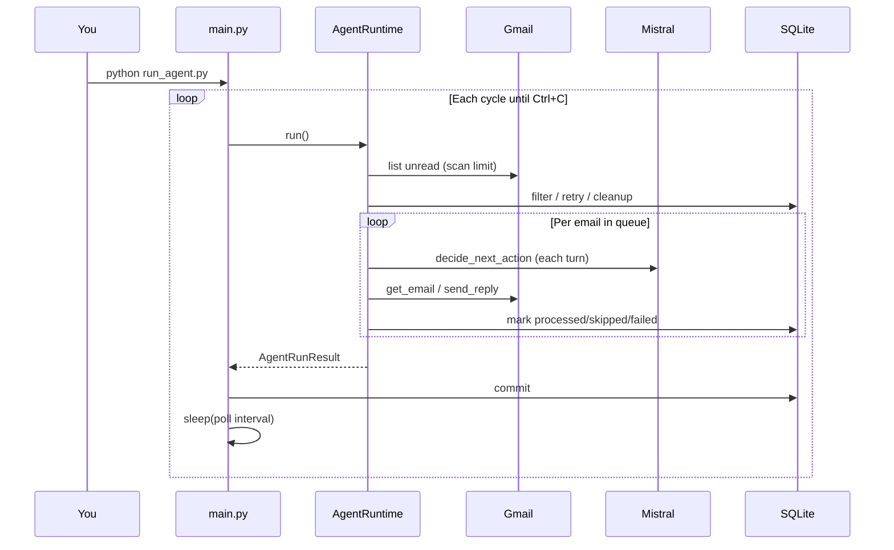
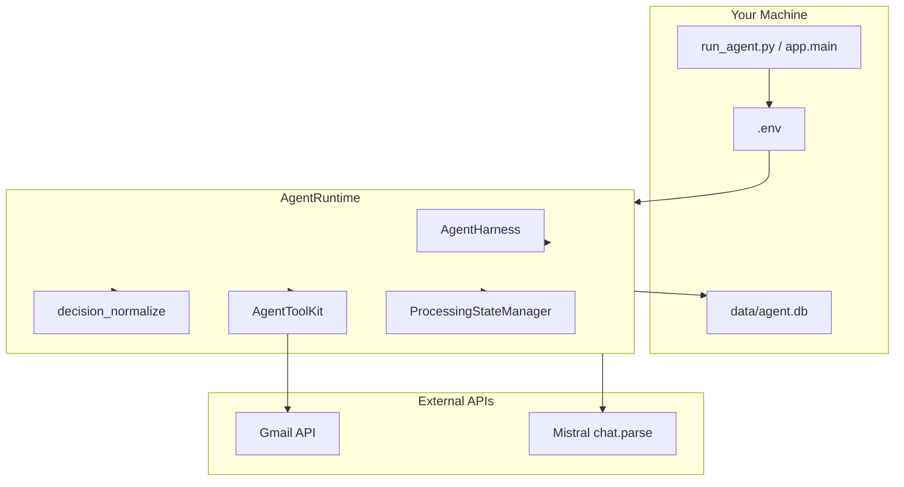
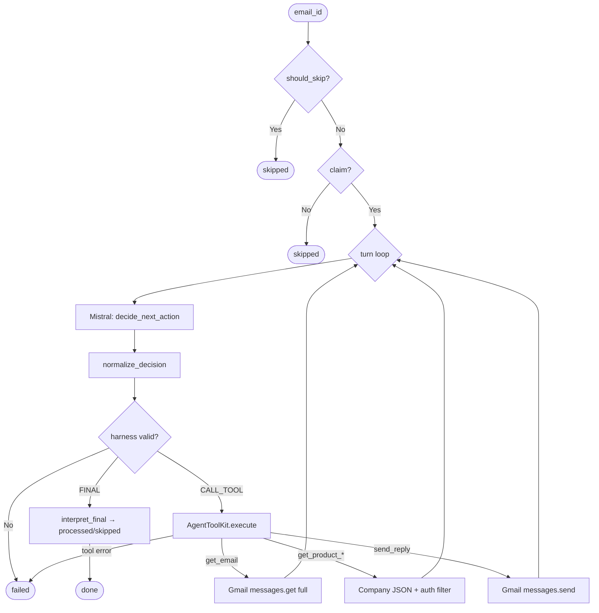

# Real API System Flow — Gmail + Mistral

How the agent works with **`EMAIL_PROVIDER=gmail`** and **`LLM_PROVIDER=mistral`**: storage model, agentic loop, continuous polling, Gmail queue handling, and API calls.

> **Orchestration:** **`AgentRuntime`** (`app/agent/runtime.py`) — **not** legacy `AgentLoop`.  
> **LangGraph:** Not used. See [`langgraph_architecture_overview.md`](langgraph_architecture_overview.md).

---

## Table of Contents

1. [Short Answers](#1-short-answers)
2. [Run Modes: Single vs Continuous](#2-run-modes-single-vs-continuous)
3. [What Is Stored vs What Is Not](#3-what-is-stored-vs-what-is-not)
4. [Gmail Integration Details](#4-gmail-integration-details)
5. [System Architecture](#5-system-architecture)
6. [Phase-by-Phase Flow](#6-phase-by-phase-flow)
7. [Per-Email Agentic Loop](#7-per-email-agentic-loop)
8. [Mistral API Calls](#8-mistral-api-calls)
9. [Gmail API Calls](#9-gmail-api-calls)
10. [Duplicate Prevention & Retries](#10-duplicate-prevention--retries)
11. [Configuration](#11-configuration)
12. [Quick Reference Card](#12-quick-reference-card)

---

## 1. Short Answers

| Question | Answer |
|----------|--------|
| Are **full incoming emails** saved locally? | **No.** Bodies live in **Gmail**; fetched into RAM during processing. |
| Does the agent run continuously? | **Optional.** `run_agent.py` polls forever; `AGENT_CONTINUOUS_MODE=true` does the same via `main.py`. |
| How avoid processing the same email twice? | SQLite `processed_emails.email_id` + Gmail mark-as-read after terminal outcomes. |
| Is it a true agentic loop? | **Yes (per email).** LLM chooses `CALL_TOOL` or `FINAL` each turn via `decide_next_action()`. |
| Where is email content first loaded? | When LLM (or normalize) calls tool `get_email` — not during `list_emails()`. |

---

## 2. Run Modes: Single vs Continuous

### Single batch (default `python -m app.main`)

```
1. Connect Gmail (OAuth token.json)
2. Scan unread IDs (GMAIL_QUERY, up to GMAIL_UNREAD_SCAN_LIMIT)
3. Filter queue (new / retry / cleanup)
4. For each email: agentic loop → tools → FINAL
5. Commit SQLite, print results, EXIT
```

### Continuous polling (`python run_agent.py`)

```
WHILE not Ctrl+C:
  1. Run single batch (above)
  2. Print AGENT RUN RESULTS
  3. Sleep AGENT_POLL_INTERVAL_SECONDS (default 60)
```



---

## 3. What Is Stored vs What Is Not

### NOT stored locally (incoming mail)

| Data | Location |
|------|----------|
| Original email body | **Gmail** (+ RAM during `get_email`) |
| Full inbox archive | **Gmail** |

### Stored locally (`data/agent.db`)

| Table | Stores |
|-------|--------|
| `processed_emails` | `email_id`, `status`, `error_message`, `skip_reason`, timestamps |
| `replies` | Outgoing reply recipient, subject, body, status |
| `agent_runs` | Per-cycle metrics (found/processed/skipped/failed) |

**Note:** Incoming body is **not** in SQLite — only Gmail message ID and processing metadata.

### Other local files

| File | Purpose |
|------|---------|
| `token.json` | Gmail OAuth session |
| `credentials.json` | Google OAuth app config |
| `data/company/*.json` | NovaAI knowledge base (authorization-filtered at runtime) |
| `.env` | API keys, Gmail query, poll interval, limits |

---

## 4. Gmail Integration Details

Configured via `.env`:

| Variable | Purpose |
|----------|---------|
| `GMAIL_QUERY` | Gmail search syntax (e.g. `in:inbox is:unread newer_than:2d`) |
| `GMAIL_MAX_MESSAGES_PER_RUN` | Max **new** emails to agent-process per cycle |
| `GMAIL_UNREAD_SCAN_LIMIT` | How many unread IDs to scan (must be ≥ max messages) |
| `GMAIL_MARK_READ_AFTER_PROCESSING` | Remove UNREAD label after terminal outcome |

**Provider behavior** (`app/email/gmail_provider.py`):

- Accurate pagination (not Gmail `resultSizeEstimate`)
- `list_emails()` returns **IDs only** (no N× metadata fetch)
- Body extraction: plain text → HTML → **snippet fallback** → subject fallback
- `mark_many_as_read()` — batch cleanup for already-handled IDs
- Attachment text parts fetched when body is in `attachmentId`

---

## 5. System Architecture



---

## 6. Phase-by-Phase Flow

| Phase | File | Action |
|-------|------|--------|
| A — Startup | `main.py`, `config.py` | Load `.env`, open SQLite |
| B — Wire | `agent.py` | `create_agent()` → Gmail + Mistral + repos |
| C — Discover | `runtime.py`, `gmail_provider.py` | Scan unread IDs |
| D — Filter queue | `runtime.py`, `repositories.py` | New / retry failed / cleanup processed |
| E — Agentic loop | `runtime.py` | Per email: LLM turns until FINAL |
| F — Finalize | `runtime.py`, `gmail_provider.py` | Mark read, commit DB |
| G — Poll wait | `main.py` | Sleep (continuous mode only) |

---

## 7. Per-Email Agentic Loop



### `normalize_decision` repairs (when Mistral misbehaves)

| Problem | Repair |
|---------|--------|
| `CALL_TOOL` with no `tool_name` on turn 1 | Default to `get_email` |
| `CALL_TOOL` with no name after product lookup | Force `send_reply` via `generate_reply()` |
| `get_product_information` missing `product_name` | Infer from subject/body (e.g. NovaSupport AI) |
| `FINAL` without reply after company info loaded | Force `send_reply` |

---

## 8. Mistral API Calls

| Call | When | Schema |
|------|------|--------|
| **`decide_next_action()`** | **Every agent turn** | `AgentDecision` |
| `generate_reply()` | Evals; normalize fallback for send | `GeneratedReply` |
| `classify_email()` | Evals only (not main agent loop) | `EmailClassification` |

**File:** `app/llm/mistral_provider.py`

**Retries:** Up to `MISTRAL_MAX_RETRIES` on timeout/429/5xx.

**Security:** Mistral never receives DB credentials or raw restricted company JSON.

---

## 9. Gmail API Calls

| Call | When | Purpose |
|------|------|---------|
| `messages.list` | Start of each cycle | Scan unread IDs (`GMAIL_QUERY`) |
| `messages.get` (full) | Tool `get_email` | Body + headers + threadId |
| `messages.send` | Tool `send_reply` | Send customer reply |
| `messages.modify` / `batchModify` | After terminal outcome / cleanup | Remove UNREAD label |

---

## 10. Duplicate Prevention & Retries

### Primary guard: SQLite

```
email_id PRIMARY KEY → claim → processing → processed | failed | skipped
```

### Gmail mark-as-read

- **Processed / skipped:** marked read immediately
- **Failed:** stays unread until max attempts, then marked read
- **Cleanup batch:** already-handled IDs still unread in Gmail → batch mark read

### Retry policy (`app/db/repositories.py`)

| Status | Retry? |
|--------|--------|
| `failed` with attempts < 2 | Yes — `reclaim_failed_for_retry()` |
| `failed` max attempts | No — mark read, log warning |
| `skipped` without reply in DB | Yes — clear and reprocess |
| Legacy untagged failures | Treated as exhausted (no infinite loop) |

---

## 11. Configuration

```env
EMAIL_PROVIDER=gmail
LLM_PROVIDER=mistral
MISTRAL_API_KEY=your_key_here
MISTRAL_MODEL=mistral-small-latest

GMAIL_CREDENTIALS_PATH=credentials.json
GMAIL_TOKEN_PATH=token.json
GMAIL_QUERY=in:inbox is:unread newer_than:2d
GMAIL_MAX_MESSAGES_PER_RUN=3
GMAIL_UNREAD_SCAN_LIMIT=100
GMAIL_MARK_READ_AFTER_PROCESSING=true

AGENT_CONTINUOUS_MODE=false
AGENT_POLL_INTERVAL_SECONDS=60

MAX_AGENT_TURNS_PER_EMAIL=15
MAX_TOOL_CALLS=10
MAX_AGENT_STEPS=50
```

```powershell
pip install -r requirements.txt
python run_agent.py          # continuous polling
python -m app.main           # single cycle (or set AGENT_CONTINUOUS_MODE=true)
```

---

## 12. Quick Reference Card

```
┌─────────────────────────────────────────────────────────────┐
│  RUN MODES                                                   │
│  • Single: python -m app.main                                │
│  • Continuous: python run_agent.py (Ctrl+C to stop)          │
├─────────────────────────────────────────────────────────────┤
│  PER EMAIL = AGENTIC LOOP (not fixed pipeline)                 │
│  • LLM chooses tool each turn until FINAL                    │
│  • Harness validates every decision                          │
│  • normalize_decision repairs common Mistral errors          │
├─────────────────────────────────────────────────────────────┤
│  EMAIL STORAGE                                               │
│  • Incoming → Gmail (RAM briefly during get_email)             │
│  • Outgoing replies → SQLite replies + Gmail Sent              │
│  • Duplicate guard → processed_emails.email_id                 │
│  • Gmail UNREAD cleared after terminal outcome               │
├─────────────────────────────────────────────────────────────┤
│  TYPICAL APIs PER REPLIED EMAIL                              │
│  • Gmail: list + get + send + mark read                      │
│  • Mistral: 3–5 decide_next_action calls (+ generate_reply   │
│    if normalize forces send)                                 │
└─────────────────────────────────────────────────────────────┘
```

*Document version: 2.0 — AgentRuntime + continuous mode + Gmail production upgrades (August 2026)*
