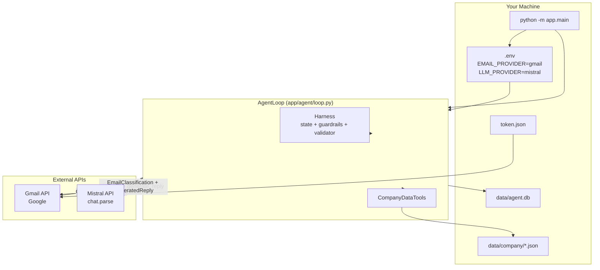
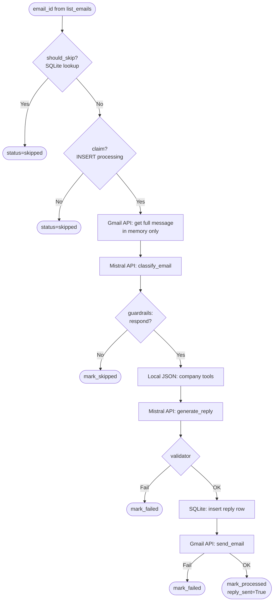
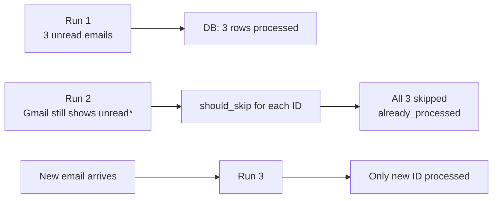

# Real API System Flow — Gmail + Mistral

This document explains **how the AI Email Agent works with real API keys** (`EMAIL_PROVIDER=gmail`, `LLM_PROVIDER=mistral`): where emails live, what gets stored locally, how each run behaves, and the full end-to-end flow.

> **LangGraph:** This project does **not** use LangGraph. The workflow is an explicit **`AgentLoop`** in `app/agent/loop.py`. For LangGraph concept mapping, see [`langgraph_architecture_overview.md`](langgraph_architecture_overview.md).

---

## Table of Contents

1. [Short Answer: Are Emails Stored Locally?](#1-short-answer-are-emails-stored-locally)
2. [Run Model: One Command = One Batch](#2-run-model-one-command--one-batch)
3. [What Is Stored vs What Is Not](#3-what-is-stored-vs-what-is-not)
4. [Gmail Message ID vs Email Content](#4-gmail-message-id-vs-email-content)
5. [Which Files Store Data (Complete Map)](#5-which-files-store-data-complete-map)
6. [System Architecture (Real APIs)](#6-system-architecture-real-apis)
7. [Phase-by-Phase Flow](#7-phase-by-phase-flow)
8. [Per-Email Pipeline (Inside One Run)](#8-per-email-pipeline-inside-one-run)
9. [Mistral API Calls (Real Key)](#9-mistral-api-calls-real-key)
10. [Gmail API Calls (Real Key)](#10-gmail-api-calls-real-key)
11. [Second Run and Later](#11-second-run-and-later)
12. [Memory Model During a Run](#12-memory-model-during-a-run)
13. [Configuration for Real APIs](#13-configuration-for-real-apis)
14. [LangGraph-Style Node Map (Current Code)](#14-langgraph-style-node-map-current-code)

---

## 1. Short Answer: Are Emails Stored Locally?

| Question | Answer |
|----------|--------|
| Are **full incoming emails** saved to disk for later processing? | **No.** Bodies live in **Gmail**. The agent fetches them over the API, processes in **memory**, then moves on. |
| Is there a local **email inbox queue**? | **No.** |
| What **is** stored locally? | **Processing state** + **reply audit log** in SQLite (`data/agent.db`). |
| Does the agent run continuously? | **No.** One CLI run processes one batch, then **exits**. |
| How does it avoid processing the same email twice? | Gmail `message_id` stored in `processed_emails` table with terminal status. |

**Source of truth for original mail:** Google Gmail servers.  
**Source of truth for “already handled”:** `data/agent.db` → `processed_emails`.

---

## 2. Run Model: One Command = One Batch

This is **not** “fetch one email → exit → fetch another in a separate process.”  
This is **not** a background daemon watching your inbox 24/7.

### What actually happens

```
YOU: python -m app.main   (once)

  1. Connect Gmail (OAuth token.json)
  2. LIST all UNREAD emails in ONE API call batch
  3. FOR EACH email in that list (sequential loop):
       fetch → classify → tools → reply → validate → send → mark DB
  4. Commit SQLite
  5. Print results
  6. EXIT

YOU: python -m app.main   (again later)

  1. Connect Gmail
  2. LIST unread again
  3. SKIP any email_id already in processed_emails (terminal status)
  4. Process only NEW / unprocessed IDs
  5. EXIT
```

### Diagram: batch run (single invocation)

```mermaid
sequenceDiagram
    participant You
    participant CLI as main.py
    participant Loop as AgentLoop
    participant Gmail as Gmail API
    participant Mistral as Mistral API
    participant DB as SQLite agent.db

    You->>CLI: python -m app.main
    CLI->>Loop: run()

    Loop->>Gmail: list unread (batch)
    Gmail-->>Loop: [id1, id2, id3, ...]

    loop For each email_id in list
        Loop->>DB: should_skip(email_id)?
        alt already processed
            Loop->>Loop: skip (no Gmail fetch for full pipeline)
        else new email
            Loop->>DB: claim(processing)
            Loop->>Gmail: get full message
            Loop->>Mistral: classify_email
            Loop->>Mistral: generate_reply
            Loop->>Gmail: send reply
            Loop->>DB: mark processed + log reply
        end
    end

    Loop-->>CLI: AgentRunResult
    CLI->>DB: commit
    CLI-->>You: print summary
```

**Key code:** `app/agent/loop.py` lines 85–96 — list once, then `for summary in summaries`.

---

## 3. What Is Stored vs What Is Not

### NOT stored locally (after run ends)

| Data | Where it lives |
|------|----------------|
| Original email body (incoming) | **Gmail only** |
| Original email subject/sender (full archive) | **Gmail only** |
| Unread/read state in Gmail | **Gmail** (agent does not copy inbox to disk) |

During processing, email content exists **only in RAM** as an `EmailMessage` object — it is discarded when `_process_email()` returns.

### Stored locally (`data/agent.db`)

#### Table: `processed_emails`

| Column | Example | Purpose |
|--------|---------|---------|
| `email_id` | Gmail message ID `"18f3a2..."` | Primary key — duplicate guard |
| `status` | `processed` / `skipped` / `failed` / `processing` | State machine |
| `classification` | JSON string from Mistral | Audit what LLM decided |
| `processed_at` | timestamp | When finished |
| `skip_reason` / `error_message` | text | Why skipped or failed |

**Does NOT store:** full incoming email body.

#### Table: `replies`

| Column | Purpose |
|--------|---------|
| `email_id` | Links to Gmail message |
| `recipient`, `subject`, `body` | **Outgoing reply** the agent generated |
| `status` | `sent` / `failed` / `validation_failed` |
| `sent_at` | When Gmail send succeeded |

#### Table: `agent_runs`

Run-level counters: found / processed / skipped / failed per invocation.

### Other local files

| File | Purpose |
|------|---------|
| `token.json` | Gmail OAuth session (not email content) |
| `credentials.json` | Google OAuth app config |
| `data/company/*.json` | NovaAI product knowledge for replies |

---

## 4. Gmail Message ID vs Email Content

When the sequence diagram shows `list unread (batch)` → `[id1, id2, id3]`, that first Gmail response contains **IDs only** — not email bodies.

### The ID is a pointer, not the message

Example Gmail message ID:

```
18f3a2b1c4d5e6f7a8b9c0d
```

This string does **not** encode subject, sender, or body. It is an opaque reference Google uses to look up the message on their servers.

```
ID alone        →  "Which message?" (catalog number)
get_email(id)   →  "Give me the actual content" (fetch the book)
```

### Three Gmail API steps in this project

| Step | Code | Gmail API | What you get |
|------|------|-----------|--------------|
| 1. List | `gmail_provider.py:72-73` | `messages.list(q="is:unread")` | **IDs only** — `[{"id":"18f3a2..."}, ...]` |
| 2. Summarize | `gmail_provider.py:76-91` | `messages.get(format="metadata")` | **From + Subject** per ID (still **no body**) |
| 3. Full fetch | `gmail_provider.py:98-119` | `messages.get(format="full")` | **Full body** + headers + threadId |

Step 3 runs inside `_process_email()` when the agent actually processes one email — not during the initial list.

```mermaid
sequenceDiagram
    participant Loop as AgentLoop
    participant Gmail as Gmail API
    participant RAM as In-Memory
    participant DB as agent.db

    Loop->>Gmail: messages.list(is:unread)
    Gmail-->>Loop: id1, id2, id3 (IDs only)

    loop list_emails() for each id
        Loop->>Gmail: get(id, metadata)
        Gmail-->>Loop: From, Subject
        Loop->>RAM: EmailSummary (id, sender, subject)
    end

    loop _process_email() for each id
        Loop->>DB: should_skip(email_id)?
        Loop->>Gmail: get(id, full)
        Gmail-->>Loop: body + headers
        Loop->>RAM: EmailMessage (discarded after step)
        Note over Loop: Mistral classify + reply
        Loop->>DB: save email_id + status + classification
        Loop->>DB: save reply body (outgoing only)
    end
```

### When is the ID written to disk?

The Gmail `email_id` is saved to SQLite when:

1. **Claim** — `ProcessedEmailRepository.claim_for_processing()` inserts row with `status=processing`
2. **Finish** — updated to `processed` / `failed` / `skipped` with optional `classification` JSON

The **incoming email body is never written** to SQLite — only the ID and processing metadata.

---

## 5. Which Files Store Data (Complete Map)

### On disk (persistent files)

| File / path | Written by | What is stored | Incoming email body? |
|-------------|------------|----------------|----------------------|
| **`data/agent.db`** | SQLAlchemy via repositories | Agent state + reply audit | **No** (incoming) |
| **`token.json`** | `app/email/gmail_provider.py:59-60` | Gmail OAuth session (access/refresh tokens) | No |
| **`credentials.json`** | You (Google Cloud download) | OAuth app client ID/secret | No |
| **`data/company/products.json`** | Static (project data) | NovaAI product catalog (incl. restricted fields) | No |
| **`data/company/services.json`** | Static | NovaAI services catalog | No |
| **`data/company/authorization_policy.json`** | Static | Allowed tools, public/restricted fields | No |
| **`data/emails/mock_emails.json`** | Static | Fake emails (**mock mode only**) | Yes (mock only) |
| **`.env`** | You | API keys, provider settings | No |

Default database path from `app/config.py:23`:

```python
database_url: str = f"sqlite:///{DATA_DIR / 'agent.db'}"
```

### Inside `data/agent.db` (SQLite tables)

| Table | Defined in | Written by | Columns that matter |
|-------|------------|------------|---------------------|
| **`processed_emails`** | `app/db/models.py:21-35` | `app/db/repositories.py` → `ProcessedEmailRepository` | `email_id` (Gmail ID), `status`, `classification` JSON, timestamps |
| **`replies`** | `app/db/models.py:38-50` | `ReplyRepository` | `email_id`, recipient, subject, **outgoing reply body**, `status` |
| **`agent_runs`** | `app/db/models.py:53-66` | `AgentRunRepository` | Run counters (found/processed/skipped/failed) |

**Who calls the repositories to save data:**

| Action | Code file | Function |
|--------|-----------|----------|
| Claim email ID | `app/harness/state.py` | `claim()` → `claim_for_processing()` |
| Mark processed | `app/harness/state.py` | `mark_processed()` |
| Mark failed/skipped | `app/harness/state.py` | `mark_failed()` / `mark_skipped()` |
| Save reply | `app/agent/loop.py:247-253` | `reply_repo.create()` |
| Mark reply sent | `app/agent/loop.py:271` | `reply_repo.mark_sent()` |
| Commit to disk | `app/main.py:70` | `session.commit()` |

### In memory only (not saved after run)

| Object | Created in | Contains | Persisted? |
|--------|------------|----------|------------|
| `EmailSummary` | `gmail_provider.list_emails()` | id, sender, subject | **No** — RAM for one run |
| `EmailMessage` | `gmail_provider.get_email()` | id, sender, subject, **body**, threadId | **No** — RAM per email step |
| `EmailClassification` | Mistral / Mock LLM | category, product names, etc. | **Partially** — JSON copy in `processed_emails.classification` |
| `GeneratedReply` | Mistral / Mock LLM | reply subject + body | **Yes** — in `replies` table (outgoing) |
| `AgentStepResult` | `loop.py:137` | Per-email run summary | **No** — printed to console only |

### On Google / Mistral servers (not your disk)

| Data | Location |
|------|----------|
| **Original incoming emails** | **Gmail** (Google servers) |
| **Sent replies** | **Gmail Sent folder** + local `replies` table |
| Mistral prompts/responses | Mistral API (not stored locally by this app) |

### Python files that **define** storage vs **write** storage

| Role | File |
|------|------|
| **Schema (table definitions)** | `app/db/models.py` |
| **Read/write logic** | `app/db/repositories.py` |
| **Open DB / sessions** | `app/db/database.py` |
| **Gmail ID + OAuth files** | `app/email/gmail_provider.py` |
| **Company JSON reads** | `app/company/repository.py` |
| **Orchestration (when to save)** | `app/agent/loop.py` |
| **Commit transaction** | `app/main.py` |

### Quick answer

```
Incoming email text     →  Gmail only (+ RAM briefly during processing)
Gmail message ID        →  data/agent.db → processed_emails.email_id
What Mistral decided    →  data/agent.db → processed_emails.classification
Reply you sent          →  data/agent.db → replies.body + Gmail Sent
Gmail login session     →  token.json
API keys                →  .env
Company facts for replies → data/company/*.json
```

---

## 6. System Architecture (Real APIs)



---

## 7. Phase-by-Phase Flow

### Phase A — Startup (no API calls yet)

| Step | File | Action |
|------|------|--------|
| A1 | `main.py:57` | Load `.env` → `Settings` |
| A2 | `main.py:65` | Open/create `data/agent.db` |
| A3 | `agent.py:33` | `create_agent()` — wire Gmail + Mistral + DB + tools |
| A4 | `agent.py:43` | `create_llm_provider("mistral", api_key=...)` |

Mistral client is created but **not called** until classification step.

### Phase B — Gmail authentication (first API touch)

| Step | File | Action |
|------|------|--------|
| B1 | `loop.py:81` | `get_email_count()` |
| B2 | `gmail_provider.py:28` | `_get_service()` — OAuth if needed |
| B3 | `gmail_provider.py:62` | Build Gmail v1 client |

See Phase 2 OAuth detail in learning guide / previous chat.

### Phase C — Discover mail (one batch)

| Step | File | Action |
|------|------|--------|
| C1 | `gmail_provider.py:67` | `messages.list(q="is:unread")` |
| C2 | `loop.py:86` | `list_emails()` — metadata for each unread ID |
| C3 | `loop.py:87` | Build list of `email_id`s for this run |

**All unread emails at this moment** are candidates for this run.

### Phase D — Process each email (sequential)

See [Section 8](#8-per-email-pipeline-inside-one-run).

### Phase E — Shutdown

| Step | File | Action |
|------|------|--------|
| E1 | `loop.py:106` | `complete_run()` — save run stats |
| E2 | `main.py:70` | `session.commit()` — persist all DB changes |
| E3 | `main.py:71` | Print `AGENT RUN RESULTS` |
| E4 | `main.py:78` | Process exits |

---

## 8. Per-Email Pipeline (Inside One Run)

For **one** Gmail message ID during **one** run:



| Step | API / Storage | Email body stored? |
|------|---------------|-------------------|
| Fetch | Gmail GET | In RAM only (`EmailMessage`) |
| Classify | Mistral | Sent in API request, not saved locally |
| Tools | Local JSON | N/A |
| Reply | Mistral | N/A |
| Send | Gmail SEND | Reply saved in `replies` table |
| Finalize | SQLite | Classification JSON + status only |

---

## 9. Mistral API Calls (Real Key)

**When:** Twice per email that reaches reply stage (once if classification fails early).

### Call 1 — Classification

```
AgentLoop._process_email()
  → MistralProvider.classify_email(sender, subject, body)
  → prompts.py CLASSIFICATION_* templates
  → client.chat.parse(model, messages, response_format=EmailClassification)
  → returns EmailClassification (Pydantic)
```

**Input to Mistral:** email text only — **no** database, **no** raw company JSON with restricted fields.

### Call 2 — Reply generation

```
AgentLoop._process_email()
  → CompanyDataTools.gather_information_for_classification()
  → company_info string (authorized fields only)
  → MistralProvider.generate_reply(..., company_info)
  → client.chat.parse(..., response_format=GeneratedReply)
```

**Retries:** Up to `MISTRAL_MAX_RETRIES` (default 3) on timeout/rate limit. Auth errors fail immediately.

**File:** `app/llm/mistral_provider.py`

---

## 10. Gmail API Calls (Real Key)

Per **unprocessed** email in a run:

| Call | Method | Purpose |
|------|--------|---------|
| Once per run | `messages.list(is:unread)` | Get all candidate IDs |
| Per email (in list) | `messages.get(format=full)` | Full body + headers |
| Per successful reply | `messages.send` | Send reply to customer |

**email_id** = Gmail's opaque message ID (not subject line).

**File:** `app/email/gmail_provider.py`

---

## 11. Second Run and Later



\*Gmail may still show messages as unread unless you read/archive them manually — the agent **does not** mark Gmail messages read in current code. Duplicate protection is **SQLite `email_id`**, not Gmail read state.

| Scenario | Behavior |
|----------|----------|
| Same email_id, already `processed` | Skip — no Mistral call, no send |
| Same email_id, previously `failed` | Skip — terminal state |
| Brand new unread email | Full pipeline |
| Delete `agent.db` | Agent forgets history — **could reply again** (dangerous) |

---

## 12. Memory Model During a Run

```
AgentRunResult (in memory for whole run)
  └── steps: list[AgentStepResult]  ← one per email in batch
        ├── email_id
        ├── status, classification, tool_calls
        └── reply_sent flag

EmailMessage (in memory per email)
  └── discarded after _process_email() returns

Gmail list (in memory)
  └── list[EmailSummary] from single list_emails() call
```

Nothing queues email bodies to disk between emails in the same run — the loop is:

```python
for summary in summaries:
    step_result = self._process_email(summary.email_id)  # fetch inside
    result.steps.append(step_result)
```

---

## 13. Configuration for Real APIs

```env
EMAIL_PROVIDER=gmail
LLM_PROVIDER=mistral
MISTRAL_API_KEY=your_key_here
MISTRAL_MODEL=mistral-small-latest
GMAIL_CREDENTIALS_PATH=credentials.json
GMAIL_TOKEN_PATH=token.json
DATABASE_URL=sqlite:///data/agent.db
```

```powershell
pip install google-auth-oauthlib google-auth-httplib2 google-api-python-client mistralai
python -m app.main
```

---

## 14. LangGraph-Style Node Map (Current Code)

If you imagine this as a graph (LangGraph terminology), **one run** looks like:

| Graph region | Current implementation |
|--------------|------------------------|
| **START** | `AgentLoop.run()` line 74 |
| **Node: list_mailbox** | `list_emails()` — one batch |
| **Subgraph per email** | `_process_email()` lines 135–278 |
| **Conditional edges** | `should_skip`, `should_respond`, `validate`, `send` |
| **Tool node** | `gather_information_for_classification` |
| **LLM nodes** | `classify_email`, `generate_reply` |
| **END** | `return AgentRunResult` |

Full LangGraph comparison: [`langgraph_architecture_overview.md`](langgraph_architecture_overview.md)

---

## Quick Reference Card

```
┌─────────────────────────────────────────────────────────────┐
│  ONE RUN = ONE BATCH                                         │
│  • List ALL unread (Gmail) once                              │
│  • Process EACH sequentially in same process                 │
│  • Exit when done                                            │
├─────────────────────────────────────────────────────────────┤
│  EMAIL STORAGE                                               │
│  • Incoming mail → Gmail (not local disk)                    │
│  • Processing memory → RAM during _process_email only        │
│  • Outgoing replies → SQLite replies table + Gmail Sent      │
│  • Duplicate guard → SQLite processed_emails.email_id        │
├─────────────────────────────────────────────────────────────┤
│  REAL APIs PER PROCESSED EMAIL                               │
│  • Gmail: get message + send reply                           │
│  • Mistral: classify + generate (2 calls)                    │
└─────────────────────────────────────────────────────────────┘
```

---

*Document version: 1.0 — matches codebase as of August 2026*
