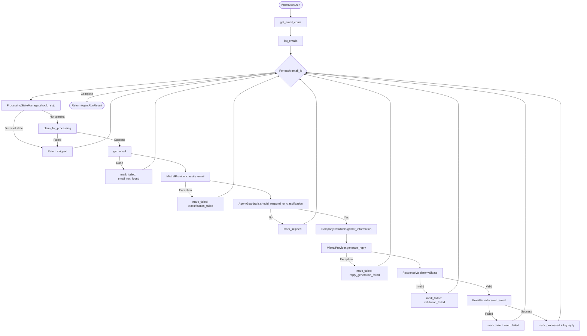
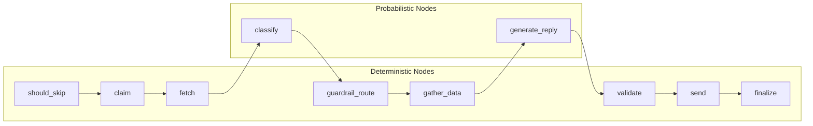
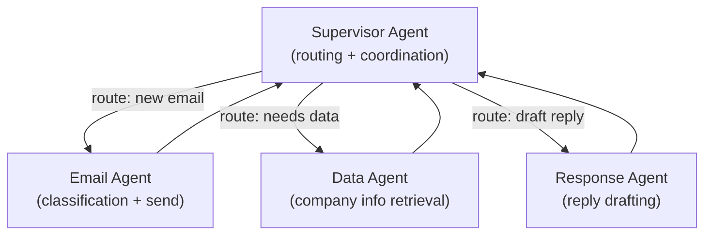
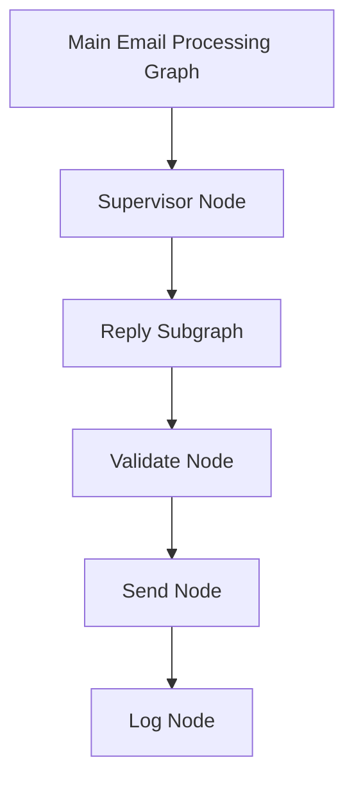
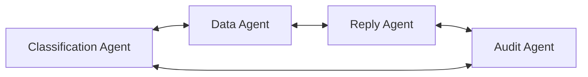
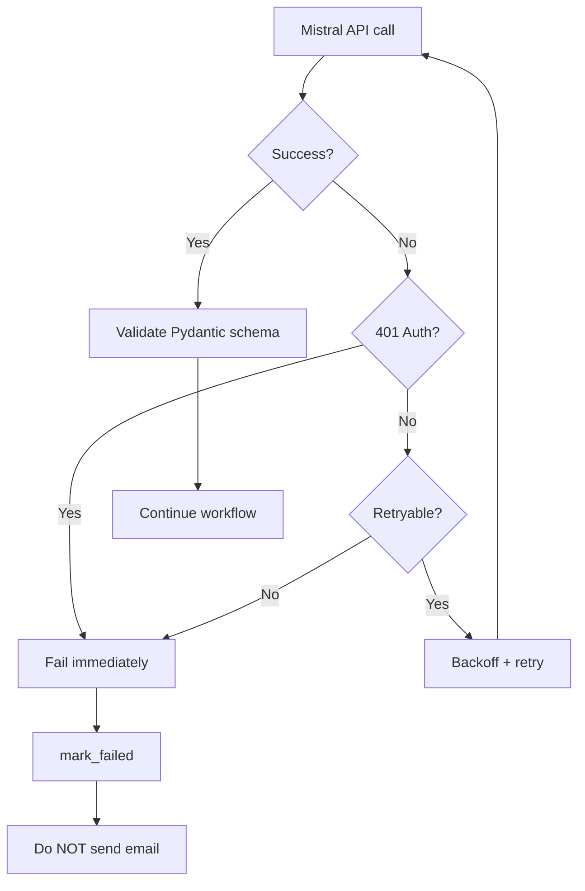
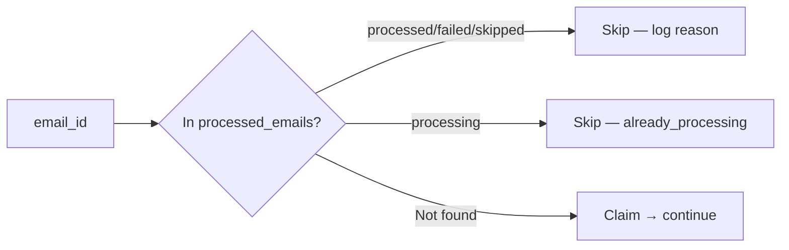

# LangGraph Architecture Overview

This document explains LangGraph concepts, how they relate to the **current AI Email Handling Agent** implementation, and how the architecture could evolve using LangGraph in the future.

> **Critical fact:** The current Email Agent does **not** use LangGraph.
>
> **On branch `feature/true-agentic-loop`:** Per-email orchestration is **`AgentRuntime`** (`app/agent/runtime.py`) with LLM-chosen tools via **`AgentDecision`**. The harness is **`AgentHarness`** (`app/harness/runtime.py`). Legacy **`AgentLoop`** (`app/agent/loop.py`) is deprecated.
>
> Diagrams below labeled **CURRENT (main / legacy)** describe the predetermined workflow. For the agentic architecture see [AGENT_WORKFLOW_DIAGRAM.md](AGENT_WORKFLOW_DIAGRAM.md) and [presentation.md](presentation.md).

> **Real API flow (Gmail + Mistral):** For email storage, batch run model, and full production API sequence diagrams, see **[REAL_API_SYSTEM_FLOW.md](REAL_API_SYSTEM_FLOW.md)**.

### Email storage & run model (summary)

| Question | Answer |
|----------|--------|
| Are incoming emails saved locally for later? | **No** — bodies stay in Gmail; agent fetches via API into memory only |
| One run or continuous? | **One CLI batch** — `list_emails()` once, process all, exit |
| What is stored in SQLite? | `email_id`, status, classification JSON, **outgoing reply** audit |
| Duplicate prevention? | `processed_emails.email_id` PRIMARY KEY — skip on next run |

---

## Table of Contents

0. [Real API System Flow (Gmail + Mistral)](#real-api-system-flow-gmail--mistral) → see [REAL_API_SYSTEM_FLOW.md](REAL_API_SYSTEM_FLOW.md)
1. [Why LangGraph?](#1-why-langgraph)
2. [Core Primitives of LangGraph](#2-core-primitives-of-langgraph)
3. [Current Email Agent Workflow (Not LangGraph)](#3-current-email-agent-workflow-not-langgraph)
4. [Mapping Current Code to LangGraph Concepts](#4-mapping-current-code-to-langgraph-concepts)
5. [Node Workflow Architecture (Current)](#5-node-workflow-architecture-current)
6. [Diagram 2 — Multi-Agent Supervisor Pattern (CONCEPTUAL)](#6-diagram-2--multi-agent-supervisor-pattern-conceptual)
7. [Diagram 3 — Hierarchical Subgraph Architecture (CONCEPTUAL)](#7-diagram-3--hierarchical-subgraph-architecture-conceptual)
8. [Diagram 4 — Peer-to-Peer Multi-Agent (CONCEPTUAL)](#8-diagram-4--peer-to-peer-multi-agent-conceptual)
9. [Single Agent vs Multi-Agent](#9-single-agent-vs-multi-agent)
10. [State Flow (Current Implementation)](#10-state-flow-current-implementation)
11. [Tool Flow (Current Implementation)](#11-tool-flow-current-implementation)
12. [Guardrails and LangGraph](#12-guardrails-and-langgraph)
13. [Deterministic vs Probabilistic Steps](#13-deterministic-vs-probabilistic-steps)
14. [Failure Paths](#14-failure-paths)
15. [Current vs Future](#15-current-vs-future)
16. [LangGraph Learning Guide](#16-langgraph-learning-guide)

---

## 1. Why LangGraph?

LangGraph is a library for building **stateful, graph-based agent workflows**. It is useful for email agents because:

| Capability | Benefit for Email Agents |
|------------|-------------------------|
| **Stateful workflows** | Track processing state across nodes (classification, tools, send) |
| **Explicit nodes** | Each step (classify, validate, send) is a visible graph node |
| **Conditional routing** | Route spam vs inquiry vs restricted-info down different paths |
| **Tool calls** | Structured tool invocation with state updates |
| **Persistence / checkpoints** | Resume interrupted runs; audit node-level state |
| **Observability** | Visualize and debug agent flow |

### What LangGraph Would **Not** Replace in This Project

Even with LangGraph, these remain **deterministic application code**:

- Duplicate email prevention (`processed_emails` PRIMARY KEY)
- Authorization field filtering (`AuthorizationService`)
- Response validation before send (`ResponseValidator`)
- Database access restrictions (no SQL tools)

LangGraph orchestrates **flow**; it does not replace **security guardrails**.

### Why the Current Project Does Not Use LangGraph

The evaluation prototype prioritizes:

1. **Explainability** — entire loop visible in `app/agent/loop.py`
2. **Simplicity** — no framework magic for a 30-minute walkthrough
3. **Testability** — direct method calls easy to unit test

LangGraph is documented here as a **future migration path**, not a current dependency.

---

## 2. Core Primitives of LangGraph

| Primitive | Description | Status in Email Agent |
|-----------|-------------|----------------------|
| **State** | Typed dict/object passed between nodes | **CURRENT** — `AgentStepResult`, DB records, dataclass fields |
| **StateGraph** | Graph builder connecting nodes | **NOT USED** — `AgentLoop.run()` is the graph |
| **Nodes** | Functions that transform state | **CURRENT** — `_process_email()` steps are implicit nodes |
| **Edges** | Fixed transitions between nodes | **CURRENT** — sequential code in `_process_email()` |
| **Conditional Edges** | Branch based on state | **CURRENT** — `if should_skip`, `if should_respond`, etc. |
| **START / END** | Graph entry and exit | **CURRENT** — `run()` start, return `AgentRunResult` |
| **Tools** | Callable functions for agents | **CURRENT** — `CompanyDataTools` (app-orchestrated) |
| **Tool Nodes** | LangGraph nodes that execute tools | **NOT USED** — tools called in Python, not LLM function-calling |
| **Reducers** | Merge state updates from nodes | **NOT USED** — explicit assignment |
| **Checkpoints / Persistence** | Save/resume graph state | **PARTIAL** — SQLite persists outcomes, not mid-node checkpoints |
| **Subgraphs** | Nested graphs | **NOT USED** |
| **Interrupts / Human-in-the-loop** | Pause for human approval | **PLANNED** — not implemented |

---

## 3. Current Email Agent Workflow (Not LangGraph)

### CURRENT — Actual Implementation

> **Standalone diagram doc:** Full structure with node-to-file mapping → [`AGENT_WORKFLOW_DIAGRAM.md`](AGENT_WORKFLOW_DIAGRAM.md)



**Source of truth:** `app/agent/loop.py` — methods `run()` and `_process_email()`

---

## 4. Mapping Current Code to LangGraph Concepts

If this project were migrated to LangGraph, the mapping would be:

| LangGraph Concept | Current Equivalent | File |
|-------------------|-------------------|------|
| Graph entry | `AgentLoop.run()` | `app/agent/loop.py` |
| State | `AgentRunResult`, `AgentStepResult`, DB rows | `app/agent/schemas.py`, `app/db/models.py` |
| Node: check state | `ProcessingStateManager.should_skip()` | `app/harness/state.py` |
| Node: claim | `ProcessingStateManager.claim()` | `app/harness/state.py` |
| Node: classify | `llm.classify_email()` | `app/llm/mistral_provider.py` |
| Conditional edge | `guardrails.should_respond_to_classification()` | `app/harness/guardrails.py` |
| Node: tools | `company_tools.gather_information_for_classification()` | `app/tools/company_data_tools.py` |
| Node: generate | `llm.generate_reply()` | `app/llm/mistral_provider.py` |
| Node: validate | `validator.validate()` | `app/harness/validator.py` |
| Node: send | `email_provider.send_email()` | `app/email/mock_provider.py` |
| Graph exit | `return result` | `app/agent/loop.py` |

---

## 5. Node Workflow Architecture (Current)

Each step in `_process_email()` acts as an implicit "node":

| Implicit Node | Purpose | Input | Output | State Change | Type |
|---------------|---------|-------|--------|--------------|------|
| **should_skip** | Duplicate check | `email_id` | skip bool + reason | None | Deterministic |
| **claim** | Atomic processing claim | `email_id` | success bool | DB → `processing` | Deterministic |
| **fetch_email** | Retrieve content | `email_id` | `EmailMessage` | None | Deterministic |
| **classify** | Semantic understanding | email text | `EmailClassification` | None | Probabilistic (Mistral) |
| **guardrail_route** | Action decision | classification | respond bool | None | Deterministic |
| **gather_company_data** | Authorized info retrieval | product/service names | info string | Tool log | Deterministic |
| **generate_reply** | Compose response | email + info | `GeneratedReply` | None | Probabilistic (Mistral) |
| **validate_reply** | Pre-send safety | reply fields | valid bool | None | Deterministic |
| **send_email** | Deliver reply | reply + recipient | sent bool | `replies` row | Deterministic |
| **finalize** | Mark complete | email_id | None | DB → `processed` | Deterministic |



---

## 6. Diagram 2 — Multi-Agent Supervisor Pattern (CONCEPTUAL)

> **CONCEPTUAL / FUTURE ARCHITECTURE** — Not implemented in the current codebase.



### When This Would Help

- High email volume with specialized sub-tasks
- Separate teams owning classification vs reply quality
- Independent scaling of data retrieval

### Disadvantages for Current Scope

- Added complexity for a single-mailbox prototype
- Harder to explain in 30 minutes
- More inter-agent state synchronization required

The current single-loop architecture is **appropriate for the assignment requirements**.

---

## 7. Diagram 3 — Hierarchical Subgraph Architecture (CONCEPTUAL)

> **CONCEPTUAL / FUTURE ARCHITECTURE** — Not implemented.



### Concepts

| Concept | Explanation |
|---------|-------------|
| **Subgraph** | Self-contained graph invoked as a node in parent graph |
| **State passing** | Parent state mapped to subgraph input; results merged back |
| **Hierarchical orchestration** | Top-level graph delegates complex sub-workflows |

In LangGraph, a reply-generation subgraph might encapsulate: gather data → generate → validate → send — keeping the main graph readable.

**Current equivalent:** All steps are inline in `_process_email()` — functionally equivalent, less modular.

---

## 8. Diagram 4 — Peer-to-Peer Multi-Agent (CONCEPTUAL)

> **CONCEPTUAL / FUTURE ARCHITECTURE** — Not implemented.



### Characteristics

- Decentralized message passing between agents
- No single supervisor — agents negotiate
- High flexibility, high complexity

### Why Not Used Here

Peer-to-peer patterns are difficult to audit, test, and secure — problematic for an email agent with strict guardrails. A supervised or single-loop architecture provides clearer control.

---

## 9. Single Agent vs Multi-Agent

| Architecture | Complexity | Control | Auditability | Best For |
|--------------|------------|---------|--------------|----------|
| **Single Agent Loop (CURRENT)** | Low | High | High | Focused workflows, strict guardrails, prototypes |
| **Supervisor Multi-Agent** | Medium | Medium | Medium | Specialized sub-tasks, team ownership |
| **Hierarchical Subgraphs** | Medium | High | High | Modular sub-workflows within one product |
| **Peer-to-Peer Network** | High | Low | Low | Research, exploratory multi-agent systems |

### Recommendation for This Project

The assignment requirements — duplicate prevention, authorization, grounded replies, logging — are best served by a **single explicit agent loop** with deterministic harness components. Multi-agent patterns add coordination overhead without solving a current requirement.

---

## 10. State Flow (Current Implementation)

### Transient State (in-memory, per run)

| Field / Object | Created By | Modified By | Consumed By | Persistent |
|----------------|------------|-------------|-------------|------------|
| `AgentRunResult` | `AgentLoop.run()` | Loop counters | CLI output | No |
| `AgentStepResult` | `_process_email()` | Each step | CLI output, counters | No |
| `EmailClassification` | Mistral/MockLLM | — | Guardrails, tools, logging | Stored as JSON in DB on success |
| `GeneratedReply` | Mistral/MockLLM | — | Validator, send, reply repo | Stored in `replies` table |
| `CompanyDataTools._call_log` | Tool calls | Each tool invocation | Step result logging | No |

### Persistent State (SQLite)

| Table | Key Fields | Purpose |
|-------|-----------|---------|
| `processed_emails` | `email_id` (PK), `status`, `classification`, `error_message`, `skip_reason` | Guardrail #1 — duplicate prevention |
| `replies` | `email_id`, `recipient`, `subject`, `body`, `status`, `sent_at` | Audit trail of outbound messages |
| `agent_runs` | `emails_found`, `emails_processed`, `emails_skipped`, `emails_failed` | Run-level metrics |

### State Transitions (`processed_emails.status`)

```
(new) → processing → processed   (success)
                   → failed      (error)
                   → skipped     (guardrail / no action)
```

Enforced in: `app/db/repositories.py` — `ALLOWED_TRANSITIONS`

---

## 11. Tool Flow (Current Implementation)

Tools are **not** LangGraph ToolNodes. The agent loop orchestrates calls:

```mermaid
sequenceDiagram
    participant Loop as AgentLoop
    participant Class as EmailClassification
    participant Tools as CompanyDataTools
    participant Auth as AuthorizationService
    participant Repo as CompanyRepository

    Loop->>Class: product_names, service_names
    Loop->>Tools: gather_information_for_classification()
    loop Each product name
        Tools->>Tools: call_tool(get_product_information)
        Tools->>Auth: get_authorized_product()
        Auth->>Repo: get_product_by_name()
        Repo-->>Auth: full record (public + restricted)
        Auth-->>Tools: filtered public fields only
    end
    Tools-->>Loop: authorized info string
    Loop->>Loop: Pass string to Mistral generate_reply()
```

### How This Prevents Direct Database Access

1. Mistral never calls tools — the loop does
2. Tools call services, not SQL
3. Authorization strips restricted fields before string reaches Mistral
4. Forbidden tool names are blocked in `CompanyDataTools.call_tool()`

---

## 12. Guardrails and LangGraph

### Guardrails in Current Architecture

| Guardrail | Where Enforced | Inside "Graph"? |
|-----------|---------------|-----------------|
| Duplicate processing | `ProcessingStateManager` + DB PK | Yes — first steps in loop |
| Authorization | `AuthorizationService` | Yes — during tool execution |
| Tool permissions | `CompanyDataTools`, `AgentGuardrails` | Yes |
| Category routing | `AgentGuardrails.should_respond_to_classification()` | Yes — after classify node |
| Response validation | `ResponseValidator` | Yes — before send node |
| Step/tool limits | `AgentGuardrails` | Yes — loop boundaries |
| No SQL tools | `ALLOWED_TOOLS` set | Yes — tool layer |

### If Migrated to LangGraph

| Guardrail | Recommended Placement |
|-----------|----------------------|
| Duplicate check | **Before graph entry** or first node — deterministic |
| Authorization | **Tool wrapper layer** — never inside Mistral node |
| Validation | **Node between generate and send** — deterministic gate |
| Send | **Final node** — only reachable via valid edge |

**Rule:** Probabilistic nodes (Mistral classify/generate) should never directly precede send without a deterministic validation node between them. The current code enforces this ordering.

---

## 13. Deterministic vs Probabilistic Steps

| Step (Implicit Node) | Type | Reason |
|---------------------|------|--------|
| should_skip | Deterministic | Exact DB state lookup |
| claim | Deterministic | Atomic state transition |
| fetch_email | Deterministic | Provider API call |
| classify | **Probabilistic** | Mistral semantic interpretation |
| guardrail_route | Deterministic | Code rules on classification fields |
| gather_company_data | Deterministic | Authorized tool execution |
| generate_reply | **Probabilistic** | Mistral text generation |
| validate_reply | Deterministic | Pattern + field checks |
| send_email | Deterministic | Provider side effect |
| finalize | Deterministic | DB state update |

In a LangGraph migration, deterministic nodes would be plain Python functions; probabilistic nodes would wrap Mistral API calls.

---

## 14. Failure Paths

### Mistral Failure



**Current code:** `app/llm/mistral_provider.py` — `_parse_structured()`

### Tool Failure

Unknown product/service → tool returns `None` → loop continues with "No authorized company information available" string → Mistral may reply that it cannot answer fully.

### Authorization Failure

Forbidden tool name → `call_tool()` returns `None`, logs warning. No data leaked.

### Duplicate Email



### Email Send Failure

Send returns `False` → `mark_failed("send_failed")` → reply record marked failed → email **not** marked processed.

**Test:** `tests/unit/test_send_failure.py`

### Response Validation Failure

Invalid reply → `mark_failed(validation_error)` → reply saved with `validation_failed` status → **no send**.

**Test:** `tests/unit/test_validator.py`

---

## 15. Current vs Future

### CURRENT — Single Email Agent (Implemented)

```
CLI Trigger
    ↓
AgentLoop (explicit Python)
    ↓
Harness (guardrails + state + validation)
    ↓
Mistral AI (classify + generate)
    ↓
CompanyDataTools (authorized data)
    ↓
EmailProvider (mock / gmail)
    ↓
SQLite (state + audit)
```

**Files:** `app/agent/loop.py`, `app/harness/`, `app/llm/mistral_provider.py`

### FUTURE — LangGraph Single Agent

```
CLI / Scheduler Trigger
    ↓
LangGraph StateGraph
    ├── Node: check_state
    ├── Node: classify (Mistral)
    ├── Conditional: should_respond
    ├── Node: tools
    ├── Node: generate (Mistral)
    ├── Node: validate
    └── Node: send
    ↓
SQLite Checkpointer + existing tables
```

Benefits: visual graph, checkpoint/resume, standardized conditional routing.

### FUTURE — Multi-Agent Supervisor

```
Supervisor Graph
    ├── Email Classification Sub-Agent
    ├── Company Data Sub-Agent
    └── Reply Generation Sub-Agent
```

Benefits: specialization, independent eval per agent.

Tradeoff: complexity, harder guardrail enforcement across agents.

---

## 16. LangGraph Learning Guide

Study sequence mapped to this Email Agent:

| Step | LangGraph Concept | Email Agent Equivalent |
|------|-------------------|------------------------|
| 1 | **State** | `AgentStepResult`, `processed_emails` rows |
| 2 | **StateGraph** | `AgentLoop.run()` — would become `StateGraph()` |
| 3 | **Nodes** | Each step in `_process_email()` |
| 4 | **Edges** | Sequential code flow between steps |
| 5 | **Conditional edges** | `if should_skip`, `if should_respond`, `if is_valid` |
| 6 | **Tool calling** | `CompanyDataTools.call_tool()` — app-orchestrated today |
| 7 | **Agent loop** | `for summary in summaries: _process_email()` |
| 8 | **Persistence** | SQLite `processed_emails` — checkpointing would add mid-run resume |
| 9 | **Subgraphs** | Could extract reply pipeline into subgraph (future) |
| 10 | **Multi-agent patterns** | Supervisor / hierarchical / P2P — all future |
| 11 | **Evals** | `evals/` — unchanged by LangGraph; still needed for Mistral quality |

### Recommended Exercise

Refactor `_process_email()` into a LangGraph `StateGraph` while keeping:

- All harness components unchanged
- All guardrails deterministic
- Mistral provider interface unchanged
- Same SQLite schema

This would validate understanding without changing security properties.

---

## Summary

| Question | Answer |
|----------|--------|
| Does this project use LangGraph? | **No** |
| What orchestrates the agent? | `AgentLoop` in `app/agent/loop.py` |
| What LLM is used? | Mistral AI (`MistralProvider`) |
| Are LangGraph diagrams in this doc current? | Only §3, §5, §10–§14 reflect current code |
| Should we add LangGraph now? | Optional future improvement — not required for assignment |

For full project documentation, see [README.md](../README.md).

For the 5-slide presentation, see [presentation.md](presentation.md).
