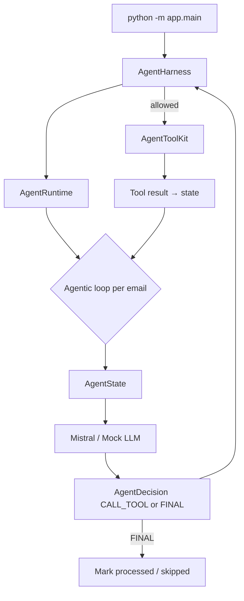

# NovaAI Email Agent — 5-Slide Design Defense

## Slide 1 — Problem & Requirements

**Business problem:** NovaAI needs automated first-line email handling for product/service inquiries.

**Requirements:**
- Poll mailbox, identify actionable inquiries
- Ground replies on **authorized** company data only
- Send replies and log outcomes
- **Never** process the same email twice
- **Never** expose raw company database to the LLM

**Constraints:** Deterministic safety for auth/idempotency; probabilistic LLM for language understanding and **tool selection**.

---

## Slide 2 — Agentic Architecture



**Why this is a genuine agentic loop:** Each turn the **LLM** reads current state + tool history and chooses the **next** action. Python does not hardcode tool order (unlike legacy `AgentLoop`).

---

## Slide 3 — Harness & Safety

**Harness** (`app/harness/runtime.py`) = deterministic control plane:

| Responsibility | Implementation |
|----------------|----------------|
| Tool registry enforcement | `TOOL_NAMES`, `validate_decision` |
| Authorization | `AuthorizationService`, forbidden tools blocked |
| Duplicate emails | `ProcessingStateManager` + SQLite PK |
| Turn / tool limits | `max_agent_turns_per_email`, `max_tool_calls` |
| Reply validation | `ResponseValidator` before `send_reply` executes |
| Logging | Decision trace on each `AgentStepResult` |

**Boundary:** Harness **permits or denies** LLM decisions — it does **not** choose business actions.

**Company data:** LLM → authorized tool → `CompanyDataService` → JSON (never SQL).

---

## Slide 4 — Deterministic vs Probabilistic

| Probabilistic (LLM) | Deterministic (Harness / code) |
|--------------------|--------------------------------|
| Which tool to call next | Tool registered? Authorized? |
| When enough info to reply | Duplicate email already processed? |
| Reply wording in `send_reply` | Reply validation before send |
| Skip vs act (via FINAL) | Max turns / max tool calls |
| Inquiry understanding | SQLite state transitions |

---

## Slide 5 — Testing & Evaluation

**Unit tests (46+):** harness validation, duplicate guard, tool auth, agent runtime integration, mock agent decisions — **no live LLM**.

**Evals:** classification accuracy, reply groundedness, **agent decision accuracy** (tool selection given state).

**Run:**
```bash
pytest
python -m evals.run_evals
python scripts/qa_verify.py
```

**Limitations / future:** Mailbox-level agentic discovery (LLM calls `list_emails`); LangGraph optional migration; production scheduler not included.

**Design defense:** We traded predetermined workflow for **LLM-driven tool loops** while keeping safety **outside** the model — the pattern production agents use for grounded, auditable automation.
