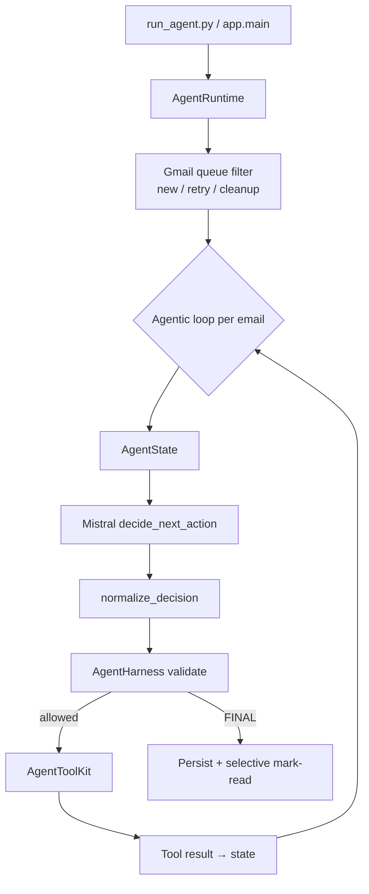

# NovaAI Email Agent — 5-Slide Design Defense

## Slide 1 — Problem & Requirements

**Business problem:** NovaAI needs automated first-line email handling for product/service inquiries.

**Requirements:**
- Poll mailbox, identify actionable inquiries
- Ground replies on **authorized** company data only
- Send replies and log outcomes
- **Never** process the same email twice
- **Never** expose raw company database to the LLM

**Constraints:** Deterministic safety for auth/idempotency; probabilistic LLM for language understanding and **tool selection**.

**Production extras:** Gmail OAuth integration, continuous inbox polling, retry limits for failed emails, **selective mark-read** (human-review emails stay unread).

---

## Slide 2 — Agentic Architecture



**Why this is a genuine agentic loop:** Each turn the **LLM** reads current state + tool history and chooses the **next** action. Python does not hardcode tool order after claim.

**Continuous mode:** Outer poll loop checks inbox every N seconds until Ctrl+C.

---

## Slide 3 — Harness & Safety

**Harness** (`app/harness/runtime.py`) = deterministic control plane:

| Responsibility | Implementation |
|----------------|----------------|
| Tool registry enforcement | `TOOL_NAMES`, `validate_decision` |
| Authorization | `AuthorizationService`, forbidden tools blocked |
| Duplicate emails | `ProcessingStateManager` + SQLite PK |
| Turn / tool limits | `max_agent_turns_per_email`, `max_tool_calls` |
| Reply validation | `ResponseValidator` before `send_reply` executes |
| Retry limits | Max 2 attempts; legacy failures not retried forever |
| Mark-read policy | `read_policy.py` — reply + spam read; job/partnership/unrelated **stay unread** |
| Skip reason codes | `human_review:*` vs `auto_handled:spam` in LLM FINAL decisions |
| Decision repair | `decision_normalize.py` for malformed Mistral output |

**Boundary:** Harness **permits or denies** LLM decisions — it does **not** choose business actions.

**Company data:** LLM → authorized tool → `CompanyDataService` → JSON (never SQL).

---

## Slide 4 — Deterministic vs Probabilistic

| Probabilistic (LLM) | Deterministic (Harness / code) |
|--------------------|--------------------------------|
| Which tool to call next | Tool registered? Authorized? |
| When enough info to reply | Duplicate email already processed? |
| Reply wording in `send_reply` | Reply validation before send |
| Skip vs act (via FINAL) | Max turns / max tool calls |
| Inquiry understanding | SQLite state transitions |
| | Selective Gmail mark-read (`read_policy.py`) |
| | Retry attempt counting |
| | `normalize_decision` fallbacks |

---

## Slide 5 — Testing, Ops & Future

**Unit tests (82):** harness, read policy, duplicate guard, agent runtime, decision normalize, Gmail helpers, failure retry — **no live LLM required for most**.

**Evals:** classification accuracy, reply groundedness, agent decision accuracy.

**Run:**
```bash
pytest
python -m evals.run_evals
python run_agent.py              # continuous Gmail polling
python -m app.main               # single cycle
python scripts/qa_verify.py
```

**Limitations:** Mailbox discovery not LLM-driven; Mistral output sometimes needs normalize; SQLite single-writer.

**Future:** Human-in-the-loop approval, Gmail `Needs-Review` label, LangGraph optional migration, PostgreSQL, observability dashboard.

**Design defense:** We use **LLM-driven tool loops** with safety **outside** the model — the pattern production agents use for grounded, auditable automation.
